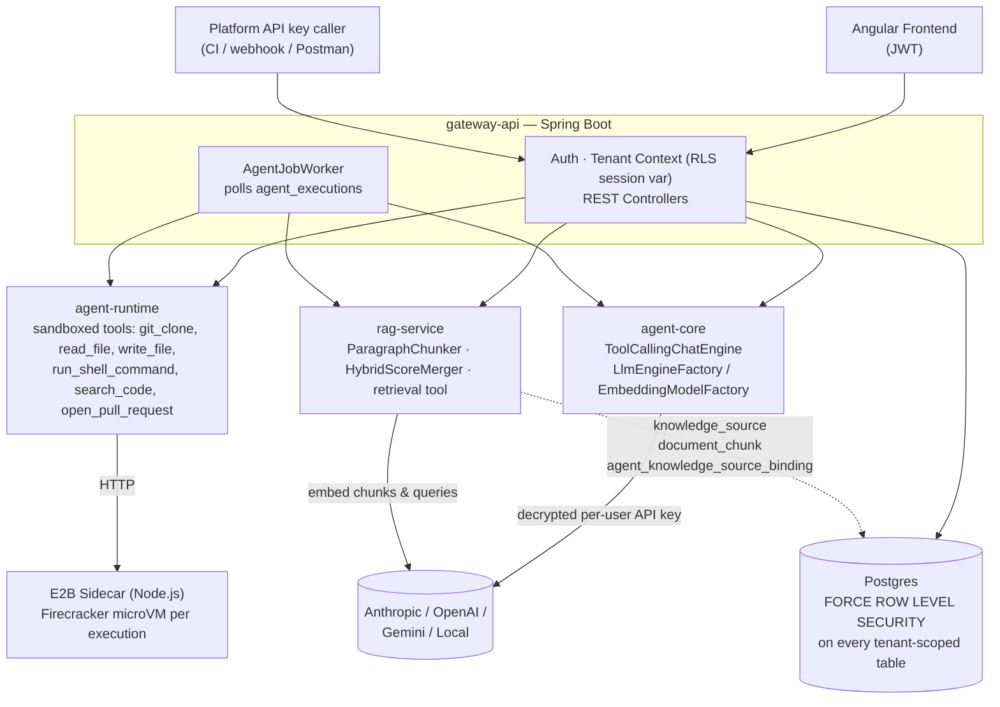
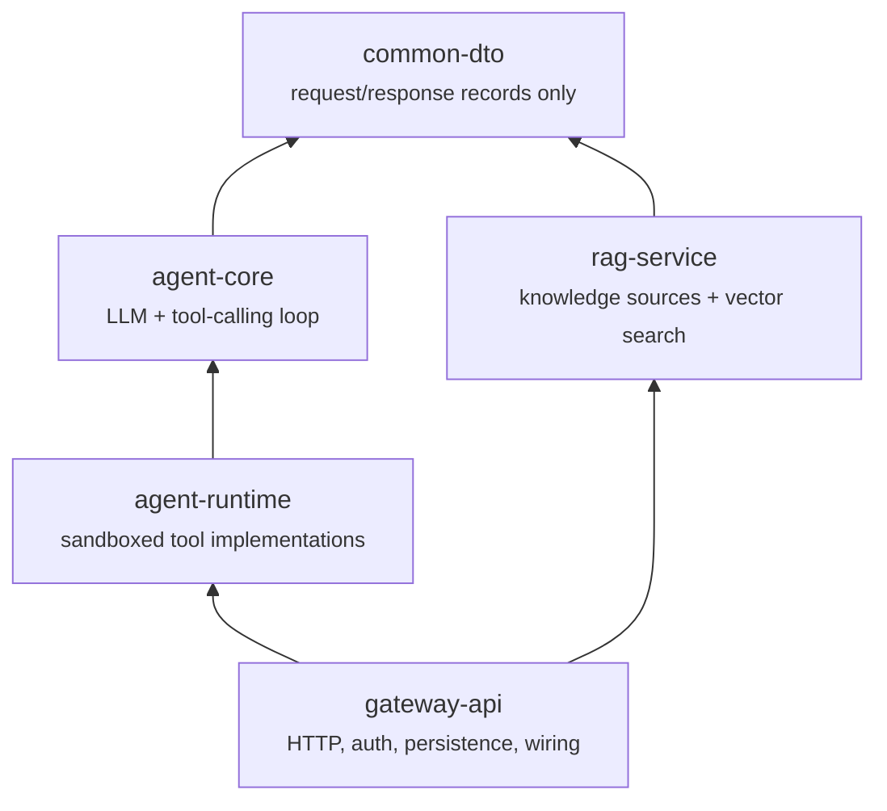
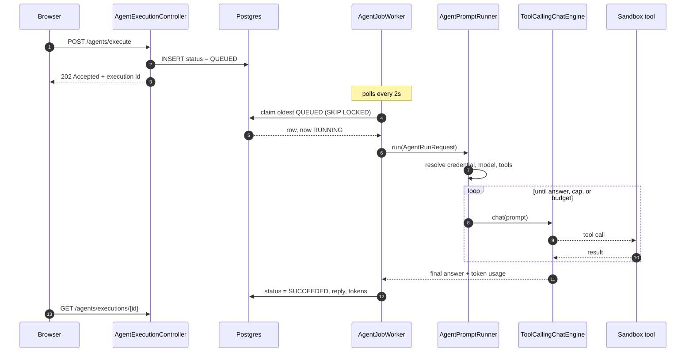
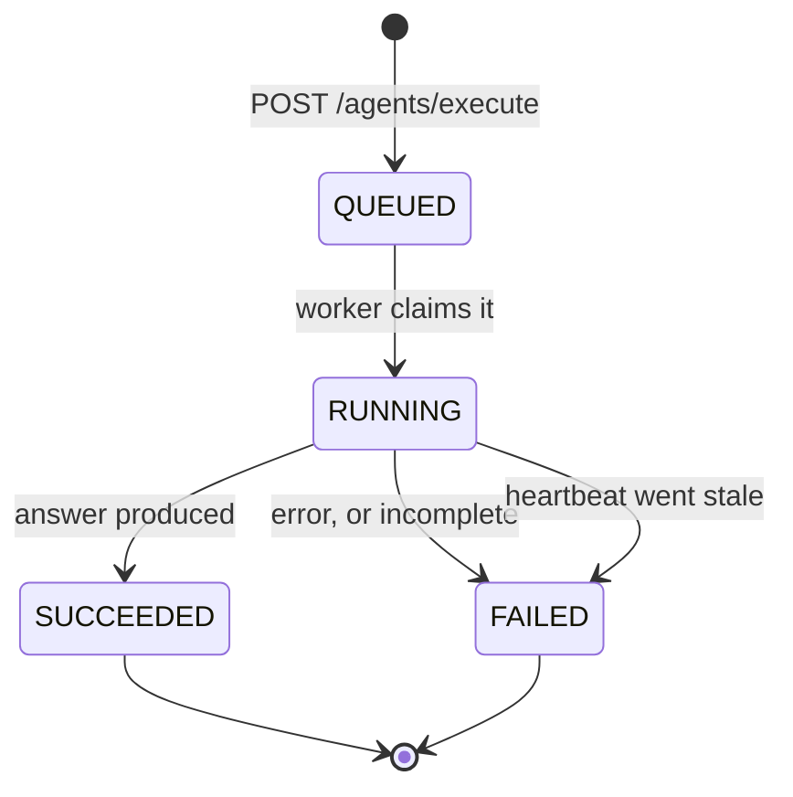

# Enterprise AI Agent Hub

A multi-tenant platform for running LLM agents that actually touch code — clone a
repository, edit it, run its tests, and open a real pull request — with every tenant's data
isolated at the database level and every tool call audited.

## Why this exists

Every engineering org is being asked "can we let an LLM touch our codebase
safely?" — and most answers to that stop at a demo: a single-tenant script
with an API key in an environment variable and no real isolation story. This
project is my answer to what it takes to run that safely as a real product:
**multiple customers on shared infrastructure, each tenant's data
provably invisible to every other tenant, agents that don't just talk about
code but actually clone it, edit it, run it, and open real pull requests
inside a sandbox, and every one of those actions audited.** It's built the
way I'd want a system like this built if I were the one accountable for a
customer's credentials or their private repository ending up somewhere it
shouldn't.

Concretely, that means the parts of this repo worth a second look:

- **Multi-tenant isolation enforced at the database, not the application** —
  Postgres Row-Level Security on every tenant-scoped table, `FORCE`d so even
  the app's own connection role can't accidentally bypass it. This is the
  same isolation model real SaaS platforms (and their SOC 2 auditors) expect.
- **Agents that actually act, inside a real sandbox** — not chat-only demos.
  A ticket becomes a cloned repo, a code change, a re-run test suite, and a
  genuine GitHub pull request, with every tool call audited.
- **Credentials treated like credentials** — AES-256-GCM envelope encryption
  at rest, per-user vendor keys (never a shared tenant-wide secret), a
  fail-closed encryption key check at startup, and a documented trail of the
  real security bugs found and fixed along the way (see [the bottom of this
  README](#bugs-found-along-the-way)) rather than a claim that nothing ever
  went wrong.
- **Retrieval-augmented generation as a first-class, multi-tenant capability**
  — not a bolted-on vector-search demo. See [Retrieval](#retrieval-rag) below.

If you're evaluating this for an engineering role: the interesting signal
isn't any single feature, it's the pattern repeated across all of them —
new capabilities plug into existing abstractions (RLS, the credential model,
the tool-calling contract) instead of each one inventing its own isolation
or security story. That consistency, and the discipline to document the
bugs found along the way instead of only the features shipped, is the part
meant to read as "how I'd actually build this at work," not just "a project
that runs."

---

# How it works

## The shape of the system



An **agent is a database row, not a class**. An `AgentDefinition` names a persona (its
system prompt), a list of tools it may use, and optionally a preferred model. Adding agent
#101 is an `INSERT`, not a deploy.

## The five modules

Dependency arrows only point one way. That rule is the architecture: it's what stops
LangChain4j, Spring, and HTTP concepts from leaking into each other.



Read upward — each module may only know about what sits beneath it.

| Module | Responsibility |
|---|---|
| `common-dto` | Shared request/response records. No logic, no framework dependency. |
| `agent-core` | Provider-agnostic LLM + embedding abstraction (LangChain4j lives here and nowhere else), and `ToolCallingChatEngine`. No Spring. |
| `agent-runtime` | Sandboxed tools via E2B microVMs, through an internal sidecar. Six tools, all sharing one persistent per-execution sandbox (`SandboxSession`). Knows nothing about Spring, JPA, or HTTP. |
| `rag-service` | Paragraph-aware chunking, hybrid (vector + full-text) search, and the `retrieval` tool. The one library module that owns JPA entities directly. |
| `gateway-api` | The only Spring Boot app, and the only module allowed to depend on all the others: auth, tenant/user/credential management, the job worker, every REST controller. |

## What it can do today

Four agents. The interesting part is how little separates them — only a prompt and a tool
list.

| Agent | Tools | For |
|---|---|---|
| `general-assistant` | `get_current_date_time` | The smoke test. Proves the loop, credentials, and tool plumbing work. |
| `planner` | `delegate_to_agent` | Breaks a goal into stages and queues other agents to carry them out. |
| `test-fixer` | clone, read, write, shell, search, open PR | Given only a repository: discovers its test command, runs the suite, fixes genuine failures one at a time, opens a PR. |
| `ticket-resolver` | the same six, plus `retrieval` | Ticket description → cloned repo → code change → verified tests → real pull request. Can consult an attached knowledge source. |

The nine tools register themselves: `ToolCatalog` collects every `ToolFactory` bean Spring
finds and never names a tool itself, so adding a tool means adding one bean, never editing
the catalog.

**Web UI** (`frontend/`, Angular): auth and forced password change, the agent catalog and
definition detail, triggering an execution, execution history with its tool-call trace,
team management, credentials, and knowledge sources. Dark mode and reduced-motion support.

## How one run actually flows

The path worth knowing by heart. Everything else is detail hanging off it.



The request returns *before* the work starts — step 3 is immediate, everything from step 4
happens on a background thread. That's why the UI polls rather than waits.

**Tenant isolation, and the one deliberate hole in it.** Every tenant-scoped table has
`FORCE ROW LEVEL SECURITY`; `TenantAwareDataSource` sets the RLS session variable on every
connection checkout, so isolation doesn't depend on anyone remembering a `WHERE` clause.
The job queue needs one exception: the worker must see queued rows across *every* tenant to
claim one. Rather than granting `BYPASSRLS` (which would apply to every table), the policy
recognises a single reserved sentinel value that only `AgentJobWorker`'s claim step ever
sets. The instant it holds the row it switches to that job's real tenant, so everything
after the claim is exactly as isolated as a normal request.

## The tool-calling loop

Inside `ToolCallingChatEngine`, one round is: send the conversation plus every tool spec,
see what comes back. It stops for exactly four reasons.


**Incomplete is not success.** Hitting the round cap or the token budget is recorded as a
failure with a reason, never as a suspiciously short answer with no explanation.

Two guards keep a long run affordable: each tool result is truncated before it enters the
conversation, and results older than a sliding window are replaced with a placeholder so the
same output isn't re-sent at full price every round.

Tools are our own `AgentTool` interface, not LangChain4j's annotation-driven one — a tool
that opens a pull request needs a tenant id and an execution id for audit, which an
annotation on a method signature can't carry.

## Execution states



`QUEUED` and `RUNNING` **both** count against the tenant's concurrency cap (default 5),
which is why the stale path matters. Before `V32`, killing the app mid-run left the row
`RUNNING` forever; five restarts during a run and that tenant hit a permanent `429` with no
way to clear it. The fix is a liveness stamp rather than a plain timeout, so two app
instances can never reap each other's live work. `ExecutionHeartbeatMonitor` runs on its own
executor rather than `@Scheduled`, because Spring's default scheduler pool is one thread and
the worker occupies it for the entire duration of a run.

## Retrieval (RAG)

A knowledge source is a tenant-owned collection of uploaded documents. On upload, text is
extracted, chunked by paragraph with configurable overlap, embedded in batches, and stored
in pgvector — all RLS-scoped exactly like every other tenant table.

Queries run **hybrid** search: vector similarity and Postgres full-text, merged by a
standalone, unit-tested `HybridScoreMerger`. Embeddings are tenant-funded through the user's
own OpenAI/Gemini credential, so retrieval costs land on the tenant that incurred them
rather than on a shared platform key.

An admin attaches a knowledge source to an agent **by configuration, not code** — a
tenant-scoped join row, so two tenants can point the same shared `AgentDefinition` at
completely different corpora.

---

# Setup

Requires a local Postgres instance and a dedicated app role (never the
Postgres superuser — RLS is silently ignored for superusers/BYPASSRLS
roles):

```sql
CREATE ROLE hub_user LOGIN PASSWORD 'password';
CREATE DATABASE agent_hub OWNER hub_user;
CREATE DATABASE agent_hub_test OWNER hub_user;  -- used by integration tests only
```

Override `DB_URL` / `DB_USERNAME` / `DB_PASSWORD` (see `application.yml`) if
you're not using these exact local defaults. `JWT_SECRET` and
`CREDENTIAL_LOCAL_KEY` also have dev-only defaults baked in — override both
in any shared/production environment.

RAG features need the `pgvector` extension **installed by a superuser**,
once per database, before `hub_user` (or any non-superuser role) ever
connects — confirmed against a real `pgvector/pgvector:pg16` instance:
`hub_user` gets `permission denied to create extension "vector"` even
though it owns `agent_hub`, so `V28__enable_pgvector.sql`'s own
`CREATE EXTENSION IF NOT EXISTS vector` can only ever *confirm* it's already
there, never actually install it. As the `postgres` superuser
(`docker-compose`'s `init.sh` does this automatically for the docker path):

```sql
\c agent_hub
CREATE EXTENSION IF NOT EXISTS vector;
\c agent_hub_test
CREATE EXTENSION IF NOT EXISTS vector;
```

The extension binary itself still needs to be present on the server first if
you're not using `docker-compose`'s `pgvector/pgvector` image — most managed
Postgres providers (RDS 15.2+, Supabase, Neon, Timescale) ship it, but a
plain local Postgres install needs the OS package for your Postgres version
(e.g. `postgresql-16-pgvector` on Debian/Ubuntu, `brew install pgvector` on
macOS) before the `CREATE EXTENSION` above will find it.

For sandboxed tool execution (`git_clone`, `read_file`, `write_file`,
`run_shell_command`, `search_code`, `open_pull_request`), the sidecar also
needs to be running — see
[`agent-runtime/sidecar/README.md`](agent-runtime/sidecar/README.md).
Quick version: `cd agent-runtime/sidecar`, set a real `E2B_API_KEY` in
`.env`, `npm start` (or `docker build`/`docker run` — both verified
working). Without it, agents whose prompts don't need a sandboxed tool still
work; only the sandboxed tool call itself fails.

`AgentJobWorker` (the `/agents/execute` queue poller) runs automatically
on startup — `JOB_WORKER_ENABLED=false` disables it entirely (no bean at
all) if you want to inspect `agent_executions` rows without a background
process racing you; `JOB_WORKER_POLL_INTERVAL_MS` controls how often it
polls (default 2000ms). `JOB_WORKER_HEARTBEAT_INTERVAL_MS`,
`JOB_WORKER_REAP_INTERVAL_MS`, and `JOB_WORKER_STALE_AFTER` tune the
abandoned-execution sweep; `stale-after` must stay comfortably longer than
the heartbeat interval, and the app refuses to start if it isn't.

## Build

```bash
mvn clean install
```

Note: sibling modules resolve dependencies from the installed jar, so after
changing a library module's API use `mvn install` — not `mvn compile` — or
the next module up will build against the stale jar.

## Run

```bash
cd gateway-api
mvn spring-boot:run
```

Flyway migrates `agent_hub` automatically on startup. First request should
be registering a tenant:

```bash
curl -X POST localhost:8080/auth/register \
  -H "Content-Type: application/json" \
  -d '{"tenantName":"Acme","tenantSlug":"acme","email":"admin@acme.com","password":"password123"}'
```

The response includes a JWT — use it as `Authorization: Bearer <token>` on
every other endpoint. A full request collection covering every endpoint
(including negative cases like RBAC denials and cross-tenant isolation) is
in [`postman/enterprise-ai-agent-hub.postman_collection.json`](postman/enterprise-ai-agent-hub.postman_collection.json).

Interactive API docs are at `localhost:8080/swagger-ui.html` once the app is
running — "Authorize" with the JWT from above to try authenticated endpoints
directly from the browser.

Frontend:

```bash
cd frontend && npm install && npm start   # http://localhost:4200
```

## Test

```bash
mvn test
```

**602 automated tests** (54 `agent-core` + 110 `agent-runtime` + 17 `rag-service` +
421 `gateway-api`). Integration tests (`@SpringBootTest`, `@ActiveProfiles("test")`) run
against `agent_hub_test`, a **separate** database, so test runs never touch the dev DB.
They boot the real Spring context, the real security filter chain, and real Postgres RLS —
that's what catches the class of bug mocks can't: cross-tenant isolation, RBAC denials,
audit-table RLS, and the abandoned-execution lockout described above.

Two categories are excluded from the default run:

```bash
# Retrieval-quality eval (precision@3 over a fixture corpus), needs a real key
OPENAI_API_KEY=sk-... mvn -pl rag-service test -Dtest=RetrievalEvalTest

# Manual sandbox integration tests, need a live sidecar + real E2B account
SANDBOX_SIDECAR_URL=http://localhost:8090/ mvn test -pl agent-runtime -Dtest=RunShellCommandToolManualIT
```

---

# API surface

| Endpoint | Auth | Purpose |
|---|---|---|
| `POST /auth/register` · `POST /auth/login` | none | Create a tenant + its first ADMIN user; get a JWT. |
| `POST /auth/change-password` | any | Complete a forced password change after first login. |
| `POST /users` · `GET /users` · `PATCH /users/{id}/role` · `DELETE /users/{id}` | ADMIN | Team management. Creation emails a server-generated temporary password (never returned in the response); guards against removing a tenant's last ADMIN. |
| `POST /api-keys` · `GET /api-keys` · `DELETE /api-keys/{id}` | ADMIN | Issue/revoke platform API keys for future CI/webhook triggers. |
| `PUT/GET/DELETE /vendor-credentials` | any | Per-user encrypted LLM keys. Summaries carry `lastUsedAt`/`lastValidatedAt`; the value is never returned. |
| `POST /vendor-credentials/test` · `GET /vendor-credentials/{provider}/models` | any | Live-validate a stored key with a real billed call; list that provider's model catalog. |
| `GET /vendor-credentials/team` · `POST .../team/{userId}/{provider}/deactivate` | ADMIN | Read-only view across the team; blind deactivate without ever reading the token. |
| `PUT/GET/DELETE /tool-credentials` · `POST /tool-credentials/test` | ADMIN | Credentials sandboxed tools need — `GIT` (clone auth) and `GITHUB` (PAT for opening PRs). |
| `GET/PUT /tenant-settings` | ADMIN | Tenant LLM provider preference, model override, and per-execution token budget. |
| `GET /agents/definitions` · `GET /agents/definitions/{slug}` | all roles | Browse the agent catalog; read one definition's full configuration. Browsing only — no admin CRUD. |
| `POST /agents/execute` | ADMIN, DEVELOPER | The real execution model: enqueues and returns `202` immediately. Rejects an unknown agent (`400`), unmet `requiredInputs` (`400`, listing every one), or a tenant at its concurrency cap (`429`) — all before persisting. |
| `GET /agents/executions` · `GET /agents/executions/{id}` | all roles | Paginated history and single-execution status. Returns `PagedModel`, not a raw `Page`. |
| `GET /agents/executions/{id}/tool-executions` | all roles | The ordered tool-call trace — what a skeptical teammate opens to verify what an agent actually did. |
| `GET /agents/executions/{id}/children` | all roles | Executions that `delegate_to_agent` queued from this one. |
| `GET /agents/executions/usage` · `GET /agents/executions/token-usage-stats` | all roles | Remaining concurrency capacity; past token usage, so a trigger form can suggest a budget. |
| `POST /agents/ping` · `POST /agents/ping-with-tools` | ADMIN, DEVELOPER | Synchronous spike endpoints. Prove the credential → provider chain and the full tool loop respectively. Not the real execution model. |
| `POST/GET /knowledge-sources` | ADMIN, DEVELOPER | Create and list a tenant's RAG knowledge sources. |
| `POST /knowledge-sources/{id}/documents` | ADMIN, DEVELOPER | Multipart upload — extracts, chunks, embeds, stores. Returns the chunk count. |
| `POST /knowledge-sources/{id}/query` | ADMIN, DEVELOPER | Hybrid-search one source directly, for testing outside an agent run. |
| `PUT/DELETE /knowledge-sources/{id}/agent-bindings/{slug}` · `GET /knowledge-sources/agent-bindings/{slug}` | ADMIN | Attach, detach, and read which source is bound to an agent. |
| `GET /actuator/health` | none | Health check. |

---

# Where we stand

| Area | State | Notes |
|---|---|---|
| Agent execution | Solid | Queued, durable, tenant-isolated, self-healing after a crash. |
| Tools & sandbox | Solid | Nine tools, one shared sandbox session per run, full audit trace. |
| RAG | Working | Upload, hybrid search, bind to an agent. No document list or delete yet. |
| Observability | Improved | Execution id in the MDC on every log line beneath a run. |
| Live visibility | **Next** | You can't watch a run in progress — the trace only appears once it finishes. |
| Cancel | **Next** | No way to stop a run. It can burn 100 rounds of paid API calls unattended. |
| Triggers | Gap | Human-click only. No schedules, no webhooks — `trigger_source` is still hardcoded. |
| Frontend tidiness | Gap | `credentials.ts` holds four unrelated concerns in one component. |

**Next up**: cancel, then live trace streaming. Both should coordinate through the database
rather than in-process memory — the same lesson the heartbeat fix taught, since the instance
handling a cancel request may not be the one running the job. After that: scheduled and
webhook triggers, which is what turns this from a manual runner into automation.

**Further out**: a CLI client and GitHub Actions integration; an automated
security-patching agent (SonarQube finding → LLM patch → verified PR); and the multi-agent
Ticket → PR pipeline this is building toward — a Planner/Coder/Reviewer sequence of
executions per ticket, each a named `AgentDefinition` from the catalog, ending in the
already-real `open_pull_request` step.

Built on a self-imposed schedule of roughly 3.5h/day, 5 days/week.

---

# Bugs found along the way

Documented because the interesting part of a system like this is what went wrong, not the
feature list.

**RLS was not actually being enforced, for a while.** Postgres exempts table owners from
their own RLS policies by default. Adding `FORCE ROW LEVEL SECURITY` fixed it — and
immediately surfaced a second bug in how the tenant session variable was being set (see
`TenantAwareDataSource`'s javadoc). A related early one: `platform_api_keys`' RLS policy
originally blocked the very pre-auth lookup it exists for.

**No sandboxed tool ever received a credential.** `sidecar/server.js` passed credentials to
E2B's `Sandbox.create()` as `envVars`, but the installed SDK (`e2b@1.13.2`) only recognises
`envs` — the option was silently ignored. Three plausible git-auth fixes were tried
(`http.extraHeader` → `credential.helper` → URL-embedded Basic auth) and each genuinely
improved something, but none could have worked, because the token never reached the sandbox
in any of them. Found by bypassing gateway-api entirely and hitting the sidecar directly
with a known test env var, then confirmed against the SDK's own type definitions.

**A real AES-256 key was committed in plaintext.** `app.credentials.local-key`'s fallback
was a working key, not an obvious placeholder like the `jwt-secret` above it — so any
environment that forgot to set the env var would have silently encrypted every tenant's
credentials with a key visible to anyone with repo access. Now the default is
`REPLACE_ME_WITH_A_STRONG_KEY_FROM_VAULT` and the encryptor's constructor rejects it at
startup, failing loudly instead of quietly working. **Running locally now requires a real
`CREDENTIAL_LOCAL_KEY`.** The previously committed value is treated as compromised.

**Abandoned executions locked a tenant out permanently.** A run claimed by an instance that
then died stayed `RUNNING` forever, and since `RUNNING` counts against the concurrency cap,
each one permanently consumed a slot — five crashes and that tenant could never trigger
anything again. Fixed with the heartbeat and reaper described above. Notable because the
trigger for it is ordinary local development: restarting the app mid-run.

**A missing `@Transactional` that mocked tests couldn't see.** Attaching and detaching a
knowledge source used a derived `deleteBy...` query with no active transaction. All unit
tests passed — the repository was mocked. Only a live `curl` against the running app
surfaced it.
