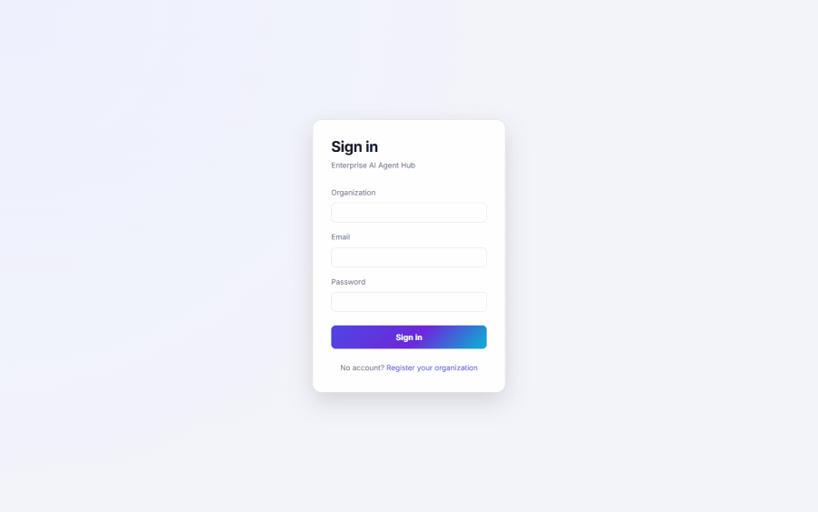
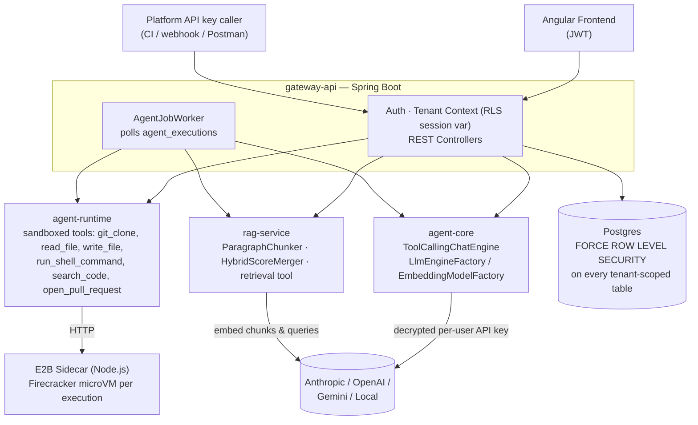
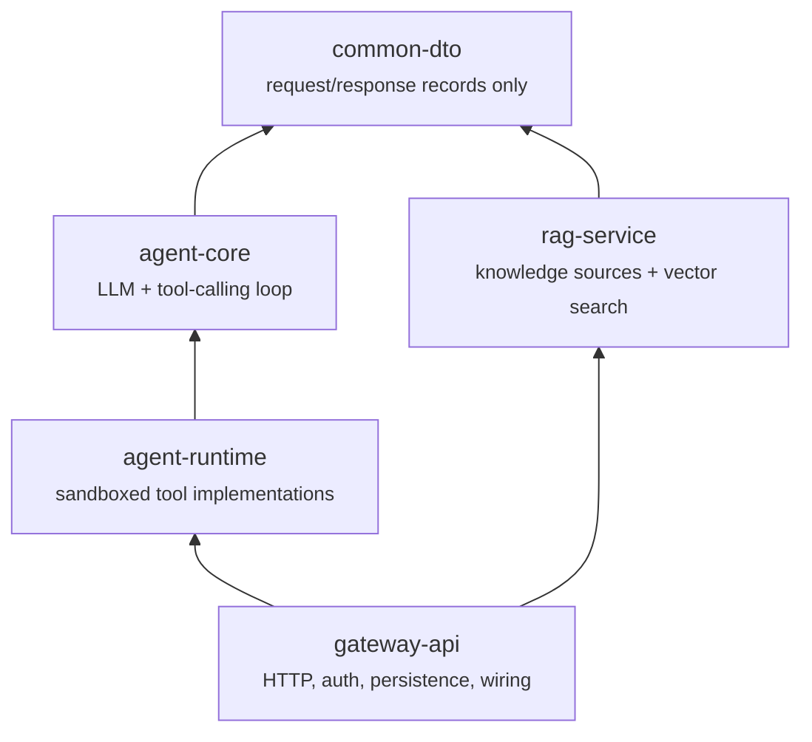
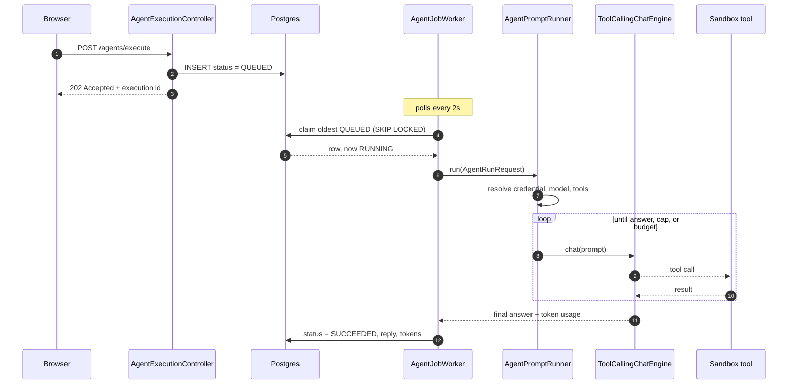
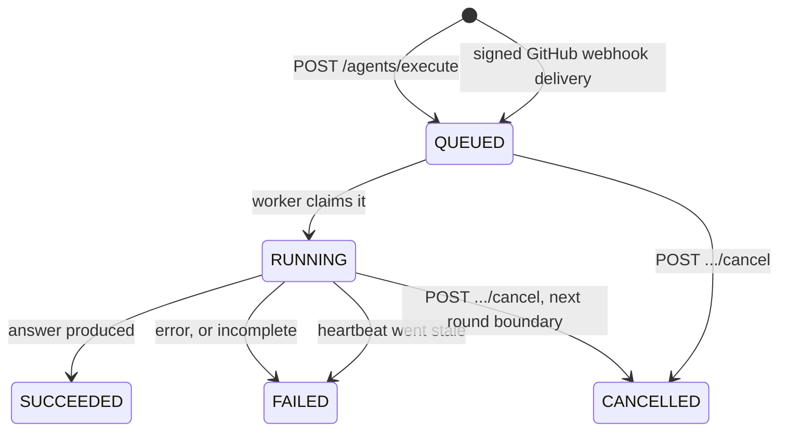

# Enterprise AI Agent Hub

[](https://github.com/pedes1999/enterprise-ai-agent-hub/actions/workflows/ci.yml)

[](LICENSE.md)

A multi-tenant platform for running LLM agents that actually touch code — clone a
repository, edit it, run its tests, and open a real pull request — with every tenant's data
isolated at the database level and every tool call audited.



*Recorded against a live local stack — real executions on a self-hosted model, no vendor key.*

## Why this exists

Most answers to "can we let an LLM touch our codebase safely?" stop at a demo: a
single-tenant script with an API key in an environment variable and no real isolation story.
This is what it takes to run that as a product — multiple customers on shared
infrastructure, each tenant's data provably invisible to every other tenant, agents that
clone, edit, run, and open real pull requests inside a sandbox, and every action audited.

The parts worth a second look:

- **Isolation enforced at the database, not the application** — Postgres Row-Level Security
  on every tenant-scoped table, `FORCE`d so even the app's own role can't bypass it.
- **Agents that act, inside a real sandbox** — a ticket becomes a cloned repo, a code
  change, a re-run test suite, and a genuine GitHub pull request.
- **Credentials treated like credentials** — AES-256-GCM envelope encryption at rest,
  per-user vendor keys, a fail-closed key check at startup, and a documented trail of the
  real bugs found along the way (see [the bottom](#bugs-found-along-the-way)).
- **RAG as a first-class multi-tenant capability** — see [Retrieval](#retrieval-rag).

---

# How it works



An **agent is a database row, not a class**. An `AgentDefinition` names a persona (its
system prompt), a list of tools it may use, and optionally a preferred model. Adding agent
#101 is an `INSERT`, not a deploy.

## The five modules

Dependency arrows point one way. That rule is the architecture: it's what stops LangChain4j,
Spring, and HTTP concepts from leaking into each other.



| Module | Responsibility |
|---|---|
| `common-dto` | Shared request/response records. No logic, no framework dependency. |
| `agent-core` | Provider-agnostic LLM + embedding abstraction (LangChain4j lives here and nowhere else), and `ToolCallingChatEngine`. No Spring. |
| `agent-runtime` | Sandboxed tools via E2B microVMs, through an internal sidecar. All sharing one persistent per-execution sandbox (`SandboxSession`). Knows nothing about Spring, JPA, or HTTP. |
| `rag-service` | Paragraph-aware chunking, hybrid (vector + full-text) search, and the `retrieval` tool. |
| `gateway-api` | The only Spring Boot app, and the only module allowed to depend on all the others. |

## What it can do today

Four agents. The interesting part is how little separates them — only a prompt and a tool list.

| Agent | Tools | For |
|---|---|---|
| `general-assistant` | `get_current_date_time` | The smoke test. Proves the loop, credentials, and tool plumbing work. |
| `planner` | `delegate_to_agent` | Breaks a goal into stages and queues other agents to carry them out. |
| `test-fixer` | clone, read, write, shell, search, open PR | Given only a repository: discovers its test command, runs the suite, fixes genuine failures one at a time, opens a PR. |
| `ticket-resolver` | the same six, plus `retrieval` | Ticket → cloned repo → code change → verified tests → real pull request. |

The nine tools register themselves: `ToolCatalog` collects every `ToolFactory` bean Spring
finds and never names a tool itself, so adding a tool means adding one bean. It also wraps
every tool it builds in `AuditingTool`, which is what makes "every tool call is audited"
true by construction rather than by each tool remembering to do it.

**Web UI** (`frontend/`, Angular): auth and forced password change, the agent catalog,
triggering an execution, execution history with its tool-call trace, spend, team,
credentials, knowledge sources, and webhook endpoints. Dark mode and reduced-motion support.

## How one run flows



The request returns *before* the work starts — step 3 is immediate. That's why the UI polls
rather than waits.

**Tenant isolation, and the one deliberate hole in it.** `TenantAwareDataSource` sets the RLS
session variable on every connection checkout, so isolation doesn't depend on anyone
remembering a `WHERE` clause. The job queue needs one exception: the worker must see queued
rows across *every* tenant to claim one. Rather than granting `BYPASSRLS` (which would apply
to every table), the policy recognises a single reserved sentinel that only `AgentJobWorker`'s
claim step ever sets. The instant it holds the row it switches to that job's real tenant.

## The tool-calling loop


**Incomplete is not success.** Hitting the round cap or the token budget is recorded as a
failure with a reason, never as a suspiciously short answer with no explanation.

Two guards keep a long run affordable: each tool result is truncated before it enters the
conversation, and results older than a sliding window are replaced with a placeholder.

Tools are our own `AgentTool` interface, not LangChain4j's annotation-driven one — a tool
that opens a pull request needs a tenant id and an execution id for audit, which an
annotation on a method signature can't carry.

## Execution states



`QUEUED` and `RUNNING` **both** count against the tenant's concurrency cap (default 5), which
is why the stale path matters: before `V32`, killing the app mid-run left the row `RUNNING`
forever, and five restarts meant a permanent `429`. The fix is a liveness stamp rather than a
plain timeout, so two instances can never reap each other's live work.

**Cancellation is cooperative.** A `QUEUED` row is cancelled synchronously. A `RUNNING` row
can only be flagged: the instance receiving the cancel may not be the one running the job, so
the flag is a DB column the round loop polls between rounds. A tool call already in flight
still finishes. The corollary, confirmed against a live local model: a single-round answer has
no second boundary at which to notice the flag, so it finishes normally and reports
`SUCCEEDED` with `cancellationRequestedAt` set — an honest record of "you asked, it had already
finished". Where it does bite, it bites hard: a run cancelled before its first round stops in
~16ms having spent **zero** tokens.

## Webhook triggers

A `pull_request` event on a wired repository queues an agent run with nobody watching. An
ADMIN creates an endpoint, pastes the returned URL and secret into GitHub, and every matching
event becomes an ordinary queued execution — same validation, concurrency cap, worker, and
cancellation as a human-triggered one.

Three problems are specific to this route:

- **Resolving a tenant before authentication exists.** A webhook carries no JWT — only the
  endpoint id in its URL. So `webhook_endpoints` has a deliberately open `SELECT` policy,
  because *discovering* the tenant is the point of the query. Safe on the same grounds
  `platform_api_keys` has allowed an unscoped lookup by hash since `V1`: the thing matched is
  an unguessable random value. The consequence, stated plainly: for this one table the tenant
  predicate in the repository is load-bearing security rather than the natural query shape.
- **Authentication is the signature, over the exact bytes.** `WebhookController` takes a
  `byte[]`, never a mapped DTO — letting Jackson parse and re-serialize first would compare
  the HMAC against different bytes. Comparison is constant-time.
- **Idempotency, because GitHub redelivers.** `UNIQUE (endpoint_id, delivery_id)` is what
  stops one pull request billing two agent runs. GitHub sends no timestamp header, so this
  uniqueness *is* the replay defence, not a nicety.

Vendor credentials are per-user with no tenant fallback, so `run_as_user_id` is `NOT NULL`:
creating an endpoint is an explicit decision about whose billed usage its runs spend.

## Cost governance

Tokens have been recorded per execution since V19; what was missing was money, and a ceiling.
That gap mattered less when a human clicked something to start every run — webhook triggers
changed it.

- **Pricing is per model, so the model is recorded.** `claude-haiku-4-5` and `claude-opus-5`
  are both `ANTHROPIC` and differ 25× on output tokens. The resolved model is stamped on the
  row *before* the run starts, so a crash mid-run still leaves something attributable.
- **A run is costed at the price that applied when it ran.** `model_pricing` is
  effective-dated and append-only; `cost_usd` is denormalized onto the execution at
  completion. A scheduled price change needs no cutover job.
- **A self-hosted run is free; an unpriced one is unknown.** A `LOCAL` run is costed at an
  honest `$0.00`. When no pricing row covers a *hosted* model, `cost_usd` stays `NULL` — never
  `0`. The two are indistinguishable inside a `SUM()` and only one is true.
- **The budget is a soft ceiling, checked at enqueue**, behind the same chokepoint as the
  concurrency cap. A run already in flight is never killed for crossing the line. It answers
  `402`, not the `429` the concurrency cap uses: a concurrency slot frees itself, a spent
  budget does not, and `429` would invite a retry loop that can never succeed.

## Rate limiting

Only the routes reachable without a credential are capped — `/webhooks/**` and `/auth/**`.
An authenticated caller is already bounded by things that cost real money and is revocable;
an anonymous one is neither. Both guarded routes do real work *before* they can reject a
caller, so `RateLimitFilter` runs **first in the chain**, ahead of authentication.

Two limitations, stated rather than hidden: counters are per-instance, so N replicas admit N×
the rate; and `X-Forwarded-For` is honoured but spoofable, which is why the tracking map is
size-capped with LRU eviction.

## Retrieval (RAG)

A knowledge source is a tenant-owned collection of uploaded documents. On upload, text is
extracted, chunked by paragraph with configurable overlap, embedded in batches, and stored in
pgvector — all RLS-scoped like every other tenant table.

Queries run **hybrid** search: vector similarity and Postgres full-text, merged by a
standalone, unit-tested `HybridScoreMerger`. Embeddings are tenant-funded through the user's
own credential. An admin attaches a source to an agent **by configuration, not code**, so two
tenants can point the same shared `AgentDefinition` at different corpora.

## Running against a local model

`GET /vendor-credentials/LOCAL/models` lists what a self-hosted server (Ollama, LM Studio,
vLLM) is actually serving. Choosing one is still explicit — every execution is costed and
audited, so the model that ran has to be the model somebody chose, and the OpenAI-compatible
`/models` route these servers share reports no capabilities, leaving an embedding-only model
indistinguishable from a chat model.

What the app does instead is make failure actionable:

```
model 'llama3.1' not found
 This local endpoint currently serves: nomic-embed-text:latest, qwen2.5-coder:7b.
 Set one as the tenant's preferredModelName (PUT /tenant-settings) or as LLM_LOCAL_MODEL_NAME.
```

---

# Setup

Requires Postgres and a dedicated app role (never the superuser — RLS is silently ignored for
superusers):

```sql
CREATE ROLE hub_user LOGIN PASSWORD 'password';
CREATE DATABASE agent_hub OWNER hub_user;
CREATE DATABASE agent_hub_test OWNER hub_user;  -- integration tests only
```

Override `DB_URL` / `DB_USERNAME` / `DB_PASSWORD` if you're not using these defaults.
`JWT_SECRET` and `CREDENTIAL_LOCAL_KEY` have dev-only defaults — override both in any shared
environment.

RAG needs `pgvector` **installed by a superuser**, once per database, before `hub_user` ever
connects: `hub_user` gets `permission denied to create extension "vector"` even though it owns
the database, so `V28`'s own `CREATE EXTENSION` can only ever *confirm* it's there.

```sql
\c agent_hub
CREATE EXTENSION IF NOT EXISTS vector;
```

`docker compose` does all of the above automatically (`docker/postgres/init.sh`) and uses the
`pgvector/pgvector` image, which ships the binary. A plain local Postgres needs the OS package
(e.g. `postgresql-16-pgvector`) first.

For sandboxed tools, the sidecar must be running — see
[`agent-runtime/sidecar/README.md`](agent-runtime/sidecar/README.md). Without it, agents whose
prompts don't need a sandboxed tool still work.

`AgentJobWorker` runs automatically on startup; `JOB_WORKER_ENABLED=false` disables it
entirely. `JOB_WORKER_HEARTBEAT_INTERVAL_MS`, `JOB_WORKER_REAP_INTERVAL_MS`, and
`JOB_WORKER_STALE_AFTER` tune the abandoned-execution sweep — `stale-after` must stay
comfortably longer than the heartbeat interval, and the app refuses to start if it isn't.

## Build and run

```bash
mvn clean install          # sibling modules resolve from the installed jar -- install, not compile
cd gateway-api && mvn spring-boot:run
cd frontend && npm install && npm start   # http://localhost:4200
```

Flyway migrates on startup. First request should be registering a tenant:

```bash
curl -X POST localhost:8080/auth/register \
  -H "Content-Type: application/json" \
  -d '{"tenantName":"Acme","tenantSlug":"acme","email":"admin@acme.com","password":"Password123!"}'
```

Use the returned JWT as `Authorization: Bearer <token>`. A full request collection including
negative cases is in [`postman/`](postman/). Interactive docs at `localhost:8080/swagger-ui.html`.

## Test

```bash
mvn test
```

**707 automated tests** (57 `agent-core` + 114 `agent-runtime` + 17 `rag-service` + 519
`gateway-api`). Integration tests run against `agent_hub_test`, a **separate** database, and
boot the real Spring context, security filter chain, and Postgres RLS — that's what catches
the class of bug mocks can't: cross-tenant isolation, RBAC denials, audit-table RLS, and the
abandoned-execution lockout.

Two categories are excluded from the default run:

```bash
# Retrieval-quality eval (precision@3 over a fixture corpus), needs a real key
OPENAI_API_KEY=sk-... mvn -pl rag-service test -Dtest=RetrievalEvalTest

# Manual sandbox integration tests, need a live sidecar + real E2B account
SANDBOX_SIDECAR_URL=http://localhost:8090/ mvn test -pl agent-runtime -Dtest=RunShellCommandToolManualIT
```

---

# API surface

| Endpoint | Auth | Purpose |
|---|---|---|
| `POST /auth/register` · `POST /auth/login` | none | Create a tenant + its first ADMIN; get a JWT. |
| `POST /auth/change-password` | any | Complete a forced password change after first login. |
| `POST/GET /users` · `PATCH /users/{id}/role` · `DELETE /users/{id}` | ADMIN | Team management. Emails a server-generated temporary password; guards against removing the last ADMIN. |
| `POST/GET /api-keys` · `DELETE /api-keys/{id}` | ADMIN | Issue/revoke platform API keys. |
| `PUT/GET/DELETE /vendor-credentials` | any | Per-user encrypted LLM keys. The value is never returned. |
| `POST /vendor-credentials/test` · `GET /vendor-credentials/{provider}/models` | any | Live-validate a stored key; list that provider's models. |
| `GET /vendor-credentials/team` · `POST .../team/{userId}/{provider}/deactivate` | ADMIN | Read-only team view; blind deactivate without reading the token. |
| `PUT/GET/DELETE /tool-credentials` · `POST /tool-credentials/test` | ADMIN | `GIT` (clone auth) and `GITHUB` (PAT for opening PRs). |
| `GET/PUT /tenant-settings` | ADMIN | Provider preference, model override, token budget, monthly spend ceiling (`null` = unlimited, `0` = frozen). |
| `GET /agents/definitions` · `GET /agents/definitions/{slug}` | all | Browse the agent catalog. |
| `POST /agents/execute` | ADMIN, DEVELOPER | Enqueues and returns `202`. Rejects unknown agent (`400`), unmet `requiredInputs` (`400`), concurrency cap (`429`), over budget (`402`) — all before persisting. |
| `POST /agents/executions/{id}/cancel` | ADMIN, DEVELOPER | Instant for `QUEUED`, cooperative for `RUNNING`. `409` if already terminal. |
| `GET /agents/executions` · `GET /agents/executions/{id}` | all | Paginated history and single-execution status. |
| `GET /agents/executions/{id}/tool-executions` | all | The ordered tool-call trace. |
| `GET /agents/executions/{id}/stream` | all | The same trace over SSE. Replays everything so far on connect. |
| `GET /agents/executions/{id}/children` | all | Executions that `delegate_to_agent` queued from this one. |
| `GET /agents/executions/usage` · `.../token-usage-stats` | all | Remaining concurrency capacity; past token usage. |
| `GET /agents/executions/spend` | all | Month-to-date spend against budget, by agent, plus the unpriced count. |
| `POST /agents/ping` · `POST /agents/ping-with-tools` | ADMIN, DEVELOPER | Synchronous spike endpoints. Not the real execution model. |
| `POST/GET /knowledge-sources` | ADMIN, DEVELOPER | Create and list RAG knowledge sources. |
| `POST /knowledge-sources/{id}/documents` | ADMIN, DEVELOPER | Multipart upload — extracts, chunks, embeds, stores. |
| `POST /knowledge-sources/{id}/query` | ADMIN, DEVELOPER | Hybrid-search one source directly. |
| `PUT/DELETE /knowledge-sources/{id}/agent-bindings/{slug}` | ADMIN | Attach and detach a source from an agent. |
| `POST/GET /webhook-endpoints` · `DELETE /webhook-endpoints/{id}` | ADMIN | Wire a GitHub repository to an agent. Create returns the signing secret **once**. |
| `POST /webhooks/github/{endpointId}` | HMAC signature | GitHub's delivery target. `202` queued, `200 DUPLICATE`, `200 IGNORED`, `401`, `404`. |
| `GET /actuator/health` | none | Health check. |
| `GET /actuator/prometheus` | any | `agent.execution` and `agent.tool.execution` metrics. Deliberately not public like health. |

---

# Where we stand

| Area | State | Notes |
|---|---|---|
| Agent execution | Solid | Queued, durable, tenant-isolated, self-healing after a crash. Cancellable. |
| Tools & sandbox | Solid | Nine tools, one shared sandbox session per run, full audit trace. |
| RAG | Working | Upload, hybrid search, bind to an agent. No document list or delete yet. |
| Observability | Improved | Execution id in the MDC; `/actuator/prometheus` exposes execution and tool-call metrics. |
| Live visibility | Working | SSE stream per execution, DB-polled so it works across instances. |
| Triggers | Working | GitHub `pull_request` webhooks, managed from the UI. No schedules yet, and no provider but GitHub. |
| Frontend tidiness | Gap | `credentials.ts` holds four unrelated concerns in one component. |

**Next up**: scheduled triggers — the other half of "runs without a human", and the one that
needs no inbound ingress at all.

**Further out**: a CLI client and GitHub Actions integration; an automated security-patching
agent (SonarQube finding → LLM patch → verified PR); and the multi-agent Ticket → PR pipeline
this is building toward — a Planner/Coder/Reviewer sequence of executions per ticket, each a
named `AgentDefinition`, ending in the already-real `open_pull_request` step.

---

# Bugs found along the way

Documented because the interesting part of a system like this is what went wrong, not the
feature list.

**RLS was not actually being enforced, for a while.** Postgres exempts table owners from their
own RLS policies by default. Adding `FORCE ROW LEVEL SECURITY` fixed it — and immediately
surfaced a second bug in how the tenant session variable was being set. A related early one:
`platform_api_keys`' RLS policy originally blocked the very pre-auth lookup it exists for.

**A third of the tools were never audited.** The execution detail page reported "No tools were
called" for a run whose reply could only have come from a tool call. Auditing lived in
`AbstractSandboxedTool`, so it covered the six tools that extended it — the three implementing
`AgentTool` directly (`get_current_date_time`, `delegate_to_agent`, `retrieval`) had their
`ToolExecutionListener` passed to the factory and silently dropped on the floor.
`get_current_date_time` had never written a single row to `tool_executions`. The one that
mattered was `delegate_to_agent`: it queues other agent executions, so a planner fanning out
sub-agents left no record of the fan-out. Fixed by moving auditing into an `AuditingTool`
decorator applied by `ToolCatalog` to everything it builds, so a tool can no longer reach the
engine unaudited — the same posture as enforcing isolation at the database rather than asking
every query to remember a `WHERE` clause. Found by running the thing and reading the UI, not
by a test: every test passed both before and after, because they all asserted the behaviour of
tools that happened to be audited.

**No sandboxed tool ever received a credential.** `sidecar/server.js` passed credentials to
E2B's `Sandbox.create()` as `envVars`, but the installed SDK only recognises `envs` — silently
ignored. Three plausible git-auth fixes were tried and each genuinely improved something, but
none could have worked, because the token never reached the sandbox in any of them. Found by
bypassing gateway-api entirely and hitting the sidecar directly with a known test env var.

**A real AES-256 key was committed in plaintext.** `app.credentials.local-key`'s fallback was a
working key, not an obvious placeholder — so any environment that forgot to set the env var
would have silently encrypted every tenant's credentials with a key visible to anyone with
repo access. Now the default is `REPLACE_ME_WITH_A_STRONG_KEY_FROM_VAULT` and the encryptor
rejects it at startup. The previously committed value is treated as compromised.

**Abandoned executions locked a tenant out permanently.** A run claimed by an instance that
died stayed `RUNNING` forever, and since `RUNNING` counts against the concurrency cap, each one
permanently consumed a slot. Notable because the trigger is ordinary local development:
restarting the app mid-run.

**A missing `@Transactional` that mocked tests couldn't see.** Attaching and detaching a
knowledge source used a derived `deleteBy...` query with no active transaction. All unit tests
passed — the repository was mocked. Only a live `curl` surfaced it.
