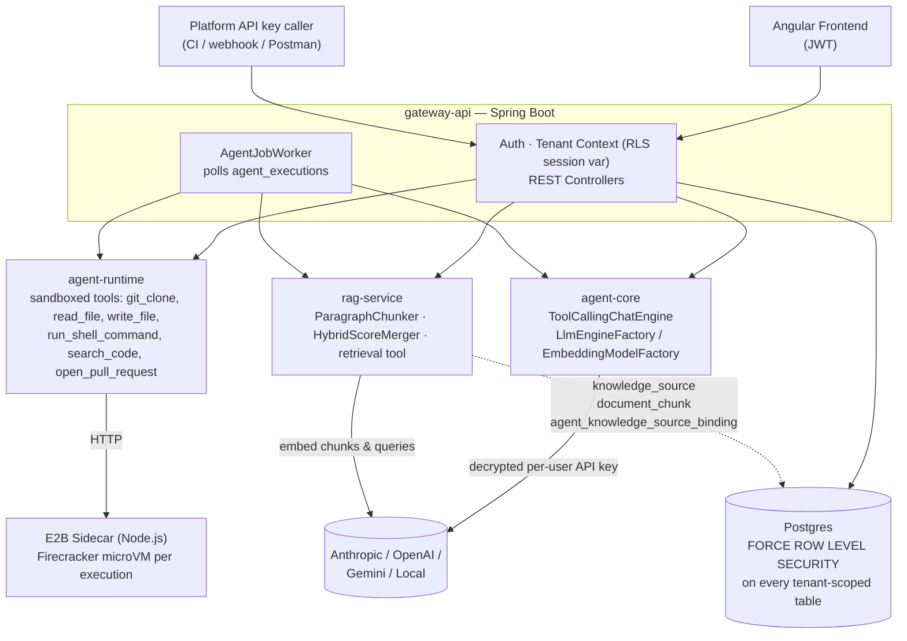
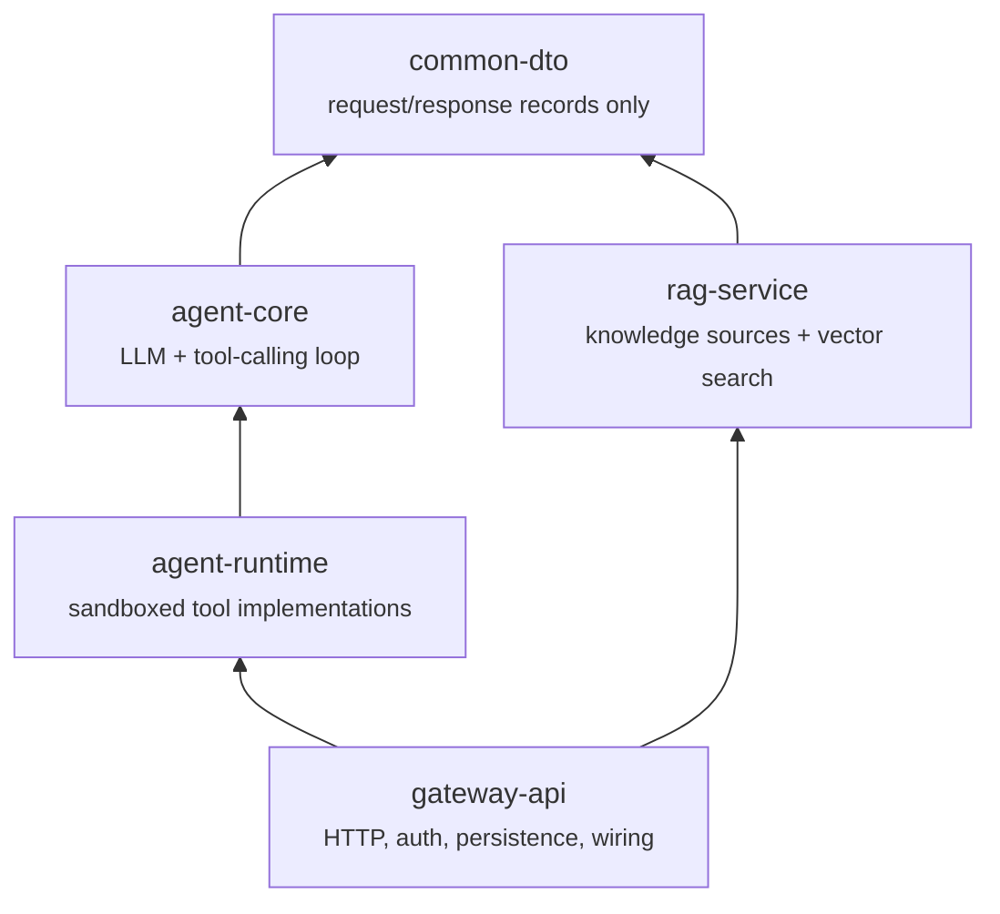
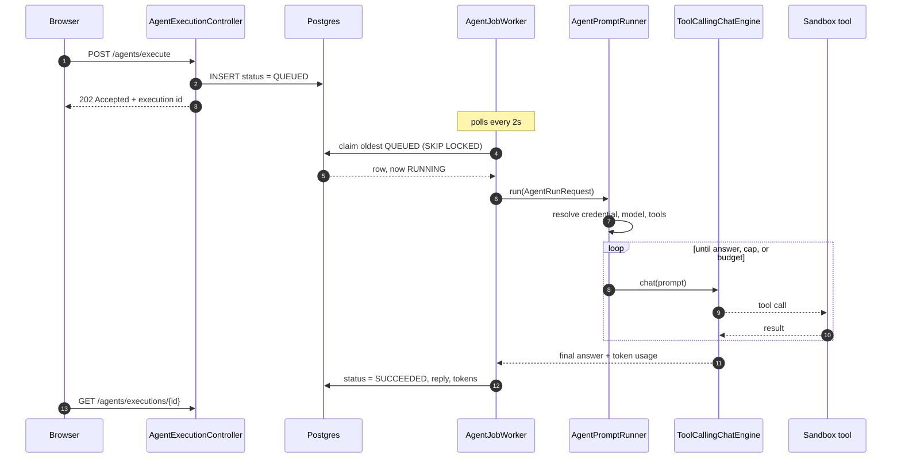
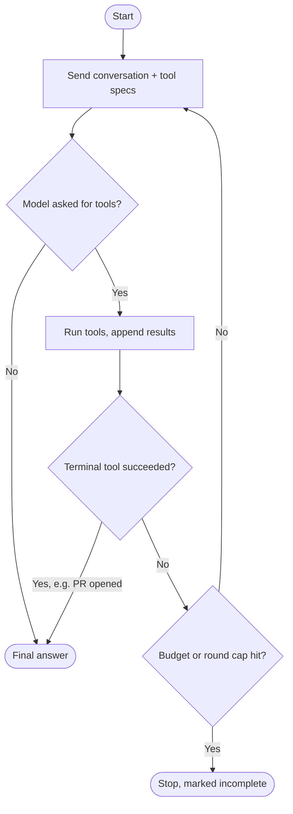
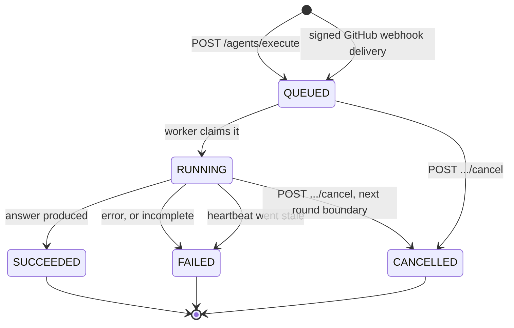

# Enterprise AI Agent Hub

[](https://github.com/pedes1999/enterprise-ai-agent-hub/actions/workflows/ci.yml)

[](LICENSE.md)

A multi-tenant platform for running LLM agents that actually touch code — clone a
repository, edit it, run its tests, and open a real pull request — with every tenant's data
isolated at the database level and every tool call audited.

## Why this exists

Every engineering org is being asked "can we let an LLM touch our codebase
safely?" — and most answers to that stop at a demo: a single-tenant script
with an API key in an environment variable and no real isolation story. This
project is my answer to what it takes to run that safely as a real product:
**multiple customers on shared infrastructure, each tenant's data
provably invisible to every other tenant, agents that don't just talk about
code but actually clone it, edit it, run it, and open real pull requests
inside a sandbox, and every one of those actions audited.** It's built the
way I'd want a system like this built if I were the one accountable for a
customer's credentials or their private repository ending up somewhere it
shouldn't.

Concretely, that means the parts of this repo worth a second look:

- **Multi-tenant isolation enforced at the database, not the application** —
  Postgres Row-Level Security on every tenant-scoped table, `FORCE`d so even
  the app's own connection role can't accidentally bypass it. This is the
  same isolation model real SaaS platforms (and their SOC 2 auditors) expect.
- **Agents that actually act, inside a real sandbox** — not chat-only demos.
  A ticket becomes a cloned repo, a code change, a re-run test suite, and a
  genuine GitHub pull request, with every tool call audited.
- **Credentials treated like credentials** — AES-256-GCM envelope encryption
  at rest, per-user vendor keys (never a shared tenant-wide secret), a
  fail-closed encryption key check at startup, and a documented trail of the
  real security bugs found and fixed along the way (see [the bottom of this
  README](#bugs-found-along-the-way)) rather than a claim that nothing ever
  went wrong.
- **Retrieval-augmented generation as a first-class, multi-tenant capability**
  — not a bolted-on vector-search demo. See [Retrieval](#retrieval-rag) below.

If you're evaluating this for an engineering role: the interesting signal
isn't any single feature, it's the pattern repeated across all of them —
new capabilities plug into existing abstractions (RLS, the credential model,
the tool-calling contract) instead of each one inventing its own isolation
or security story. That consistency, and the discipline to document the
bugs found along the way instead of only the features shipped, is the part
meant to read as "how I'd actually build this at work," not just "a project
that runs."

---

# How it works

## The shape of the system



An **agent is a database row, not a class**. An `AgentDefinition` names a persona (its
system prompt), a list of tools it may use, and optionally a preferred model. Adding agent
#101 is an `INSERT`, not a deploy.

## The five modules

Dependency arrows only point one way. That rule is the architecture: it's what stops
LangChain4j, Spring, and HTTP concepts from leaking into each other.



Read upward — each module may only know about what sits beneath it.

| Module | Responsibility |
|---|---|
| `common-dto` | Shared request/response records. No logic, no framework dependency. |
| `agent-core` | Provider-agnostic LLM + embedding abstraction (LangChain4j lives here and nowhere else), and `ToolCallingChatEngine`. No Spring. |
| `agent-runtime` | Sandboxed tools via E2B microVMs, through an internal sidecar. Six tools, all sharing one persistent per-execution sandbox (`SandboxSession`). Knows nothing about Spring, JPA, or HTTP. |
| `rag-service` | Paragraph-aware chunking, hybrid (vector + full-text) search, and the `retrieval` tool. The one library module that owns JPA entities directly. |
| `gateway-api` | The only Spring Boot app, and the only module allowed to depend on all the others: auth, tenant/user/credential management, the job worker, every REST controller. |

## What it can do today

Four agents. The interesting part is how little separates them — only a prompt and a tool
list.

| Agent | Tools | For |
|---|---|---|
| `general-assistant` | `get_current_date_time` | The smoke test. Proves the loop, credentials, and tool plumbing work. |
| `planner` | `delegate_to_agent` | Breaks a goal into stages and queues other agents to carry them out. |
| `test-fixer` | clone, read, write, shell, search, open PR | Given only a repository: discovers its test command, runs the suite, fixes genuine failures one at a time, opens a PR. |
| `ticket-resolver` | the same six, plus `retrieval` | Ticket description → cloned repo → code change → verified tests → real pull request. Can consult an attached knowledge source. |

The nine tools register themselves: `ToolCatalog` collects every `ToolFactory` bean Spring
finds and never names a tool itself, so adding a tool means adding one bean, never editing
the catalog.

**Web UI** (`frontend/`, Angular): auth and forced password change, the agent catalog and
definition detail, triggering an execution, execution history with its tool-call trace,
team management, credentials, and knowledge sources. Dark mode and reduced-motion support.

## How one run actually flows

The path worth knowing by heart. Everything else is detail hanging off it.



The request returns *before* the work starts — step 3 is immediate, everything from step 4
happens on a background thread. That's why the UI polls rather than waits.

**Tenant isolation, and the one deliberate hole in it.** Every tenant-scoped table has
`FORCE ROW LEVEL SECURITY`; `TenantAwareDataSource` sets the RLS session variable on every
connection checkout, so isolation doesn't depend on anyone remembering a `WHERE` clause.
The job queue needs one exception: the worker must see queued rows across *every* tenant to
claim one. Rather than granting `BYPASSRLS` (which would apply to every table), the policy
recognises a single reserved sentinel value that only `AgentJobWorker`'s claim step ever
sets. The instant it holds the row it switches to that job's real tenant, so everything
after the claim is exactly as isolated as a normal request.

## The tool-calling loop

Inside `ToolCallingChatEngine`, one round is: send the conversation plus every tool spec,
see what comes back. It stops for exactly four reasons.



**Incomplete is not success.** Hitting the round cap or the token budget is recorded as a
failure with a reason, never as a suspiciously short answer with no explanation.

Two guards keep a long run affordable: each tool result is truncated before it enters the
conversation, and results older than a sliding window are replaced with a placeholder so the
same output isn't re-sent at full price every round.

Tools are our own `AgentTool` interface, not LangChain4j's annotation-driven one — a tool
that opens a pull request needs a tenant id and an execution id for audit, which an
annotation on a method signature can't carry.

## Execution states



`QUEUED` and `RUNNING` **both** count against the tenant's concurrency cap (default 5),
which is why the stale path matters. Before `V32`, killing the app mid-run left the row
`RUNNING` forever; five restarts during a run and that tenant hit a permanent `429` with no
way to clear it. The fix is a liveness stamp rather than a plain timeout, so two app
instances can never reap each other's live work. `ExecutionHeartbeatMonitor` runs on its own
executor rather than `@Scheduled`, because Spring's default scheduler pool is one thread and
the worker occupies it for the entire duration of a run.

**Cancellation is cooperative, not instant.** A `QUEUED` row is cancelled synchronously —
it was never claimed, so there's nothing to interrupt. A `RUNNING` row can only be flagged:
the instance that receives the cancel request over HTTP may not be the instance actually
running the job (the same lesson `V32`'s heartbeat already had to learn), so the flag is a
DB column `ToolCallingChatEngine`'s round loop polls between rounds, not an in-process
signal. A tool call already in flight (e.g. a long shell command in the sandbox) still
finishes; the loop exits at the *next* round boundary, with no forced "let me summarize"
model call the way hitting the round cap or token budget gets — an explicit cancel means
stop spending, full stop.

The corollary, confirmed against a live local model: **a run that never starts another
round can't be stopped.** A single-round answer (no tool calls) has no second boundary at
which to notice the flag, so it finishes normally and reports `SUCCEEDED` with
`cancellationRequestedAt` set — an honest record of "you asked, it had already finished".
That's the intended tradeoff: cancellation exists to stop the expensive case (a long
multi-round tool loop burning paid calls), and the in-flight provider call itself is not
interruptible. Where it does bite, it bites hard — a run cancelled before its first round
stops in ~16ms having spent **zero** tokens.

## Webhook triggers

A `pull_request` event on a wired repository queues an agent run with nobody watching. An
ADMIN creates an endpoint (`POST /webhook-endpoints`), pastes the returned URL and secret
into GitHub, and every matching event from then on becomes an ordinary queued execution —
same validation, same concurrency cap, same worker, same cancellation and live streaming as
a human-triggered one. Only `trigger_source` and who it runs as differ.

Three problems here are worth spelling out, because they're the ones this route creates that
no other endpoint has.

**Resolving a tenant before authentication exists.** Every other endpoint gets a tenant for
free: authenticate, read it off the principal, and `TenantAwareDataSource` has RLS set up
before the handler runs. A webhook carries no JWT, no API key, no session — only the
endpoint id in its own URL. So `webhook_endpoints` has a deliberately open `SELECT` policy
(`USING (true)`), because *discovering* the tenant is the point of the query and it therefore
cannot itself be tenant-scoped. It's safe on the same grounds `platform_api_keys` has allowed
an unscoped lookup by hash since `V1`: the thing being matched is an unguessable random
value, and the row's secret is ciphertext whose key never leaves the application.

That openness has a consequence worth stating plainly: for this one table the *database* is
not filtering by tenant, so the tenant predicate in `WebhookEndpointRepository` is
load-bearing security rather than the natural query shape. `webhook_deliveries`, by
contrast, is written only after the tenant is known and keeps ordinary closed RLS. Verified
directly against Postgres: with no tenant context set, `webhook_endpoints` returns its rows
and `webhook_deliveries` returns none of the rows that exist.

The ordering this forces is easy to get wrong. `TenantAwareDataSource` sets the Postgres
session variable at *connection checkout*, so the lookup and the write cannot share a
transaction — the connection would already be pinned to an empty tenant. The write half
lives in a separate bean (`WebhookDeliveryRecorder`) precisely so its transaction begins
after `TenantContext` is set.

**Authentication is the signature, over the exact bytes.** `WebhookController` takes a
`byte[]` body, never a mapped DTO: GitHub signs what it sent, and letting Jackson parse and
re-serialize first would compare the HMAC against different bytes and reject every genuine
delivery. Comparison is constant-time (`MessageDigest.isEqual`) — a byte-at-a-time compare
leaks, through timing, how many leading bytes of a guess were right. Nothing logs the secret
or the expected digest, since the expected digest is as good as the secret for forging one
request.

**Idempotency, because GitHub redelivers.** Retries and manual redeliveries reuse the same
`X-GitHub-Delivery` id, so `UNIQUE (endpoint_id, delivery_id)` is what stops one pull
request billing two agent runs. GitHub sends no timestamp header — unlike Stripe there is no
signed timestamp to enforce a replay window against — so this uniqueness *is* the replay
defence, not a nicety. A redelivery returns `200` with the id of the run the **first**
delivery created, so the caller learns where the work went instead of just being told "no".

**Whose API key pays?** Vendor credentials are per-user with no tenant fallback, and
`AgentPromptRunner.resolveApiKey()` rejects a null user outright — so an unattended run has
to name someone. `webhook_endpoints.run_as_user_id` is `NOT NULL` for that reason: creating
an endpoint is an explicit decision about whose billed usage its runs spend, and the audit
trail stays honest about it.

Status codes are chosen for how they read in a repository's delivery log: a ping, an ignored
action, and a redelivery are all successes, because GitHub retries `5xx` and shows `4xx` in
red — neither is the right prompt for "we deliberately did nothing".

## Cost governance

Tokens have been recorded per execution since V19. What was missing was money — and a
ceiling.

That gap mattered less when every run started with a human clicking something. Webhook
triggers changed it: a busy repository, a CI loop pushing fifty commits, or one
misconfigured endpoint now spends a real vendor credential with nobody watching. The
per-execution `maxTokens` cap bounds one run and the concurrency cap bounds how many run at
once, but neither bounds spend over time — five concurrent runs, forever, is unbounded.

**Pricing is per model, so the model has to be recorded.** `agent_executions` stored
`llm_provider` but not the model name, and that isn't good enough: `claude-haiku-4-5` and
`claude-opus-5` are both `ANTHROPIC` and differ 25× on output tokens. `AgentJobWorker` now
stamps the resolved model onto the row *before* the run starts, so a crash mid-run still
leaves something attributable.

**A run is costed at the price that applied when it ran.** `model_pricing` is effective-dated
and append-only by convention — a price change is a new row with a later `effective_from`,
never an edit — and `cost_usd` is denormalized onto the execution at completion. Recomputing
on read would silently re-price last quarter every time a vendor changed a rate. It also
means a scheduled price change needs no cutover job: insert next month's rate today, and
runs keep costing the old one until that instant passes.

**A self-hosted run is free; an unpriced one is unknown.** These are different answers and
the report says so. Ollama, LM Studio, and vLLM produce no vendor invoice, so a `LOCAL` run
is costed at an honest `$0.00` and a tenant running entirely on local models sees a complete
total with nothing flagged. (That's vendor spend, not total cost of ownership — the
electricity is real, it just isn't billed through this system.) This also can't be solved by
seeding prices: a local model name is whatever the operator happened to pull.

**An unpriced run is never a free run.** This is the invariant the whole feature rests on.
When no `model_pricing` row covers a *hosted* model, `cost_usd` stays `NULL` — never `0`. The two are
indistinguishable inside a `SUM()`, and only one of them is true: a tenant running entirely
on an unpriced model would otherwise show `$0.00` forever and sail through every budget check
while spending real money. `GET /agents/executions/spend` reports the unpriced count
alongside the total, so a partial figure is never presented as a complete one.

**The budget is a soft ceiling, checked at enqueue.** It lives behind the same chokepoint as
the concurrency cap — inside `AgentExecutionService.enqueue()` — so the API, a webhook
delivery, and a `delegate_to_agent` sub-run are all covered without any of them remembering
to ask. A run already in flight is never killed for crossing the line: that would waste
everything already spent and can leave a cloned repository half-modified with no PR to show
for it. The honest consequence, stated rather than hidden: actual spend can overshoot by at
most the cost of what was in flight when the ceiling was crossed.

It answers `402 Payment Required`, not the `429` the concurrency cap uses. A concurrency slot
frees itself, so `429`'s "try again shortly" is true there. A spent budget does not — retrying
fails identically until the month rolls over or an admin raises the ceiling, and answering
`429` would invite exactly the retry loop that can never succeed, which GitHub's webhook
redelivery would happily supply.

The period is the UTC calendar month, matching how vendors invoice, so the figure reconciles
against a real Anthropic bill instead of drifting against every statement the way a rolling
30-day window would.

## Running against a local model

`GET /vendor-credentials/LOCAL/models` lists what a self-hosted server (Ollama, LM Studio,
vLLM) is actually serving, so the Credentials page offers a dropdown of real models rather
than a free-text guess.

Choosing one is still explicit — the app never silently picks a model for you. Two reasons.
Every execution here is costed and audited, so the model that ran has to be the model
somebody chose; and it isn't safely guessable anyway, because the OpenAI-compatible
`/models` route these servers share reports **no capabilities**, leaving an embedding-only
model indistinguishable from a chat model in that listing. Picking the wrong one fails later
and more confusingly than naming a missing model does.

What the app does instead is make that failure actionable. Because tags match exactly, the
most common local failure is naming a model this machine doesn't have — so the error carries
the answer the app already knows:

```
model 'llama3.1' not found
 This local endpoint currently serves: nomic-embed-text:latest, qwen2.5-coder:7b.
 Set one as the tenant's preferredModelName (PUT /tenant-settings) or as LLM_LOCAL_MODEL_NAME.
```

The hint is strictly additive (see `LocalModelHint`): it appends to a LOCAL model-not-found
and otherwise returns the provider's message untouched, so a refused connection or a hosted
provider's error never collects an irrelevant model list. It reaches both the synchronous
ping and the error stored on a failed execution row — the async one matters more, since
that's what gets read out of history hours later.

## Retrieval (RAG)

A knowledge source is a tenant-owned collection of uploaded documents. On upload, text is
extracted, chunked by paragraph with configurable overlap, embedded in batches, and stored
in pgvector — all RLS-scoped exactly like every other tenant table.

Queries run **hybrid** search: vector similarity and Postgres full-text, merged by a
standalone, unit-tested `HybridScoreMerger`. Embeddings are tenant-funded through the user's
own OpenAI/Gemini credential, so retrieval costs land on the tenant that incurred them
rather than on a shared platform key.

An admin attaches a knowledge source to an agent **by configuration, not code** — a
tenant-scoped join row, so two tenants can point the same shared `AgentDefinition` at
completely different corpora.

---

# Setup

Requires a local Postgres instance and a dedicated app role (never the
Postgres superuser — RLS is silently ignored for superusers/BYPASSRLS
roles):

```sql
CREATE ROLE hub_user LOGIN PASSWORD 'password';
CREATE DATABASE agent_hub OWNER hub_user;
CREATE DATABASE agent_hub_test OWNER hub_user;  -- used by integration tests only
```

Override `DB_URL` / `DB_USERNAME` / `DB_PASSWORD` (see `application.yml`) if
you're not using these exact local defaults. `JWT_SECRET` and
`CREDENTIAL_LOCAL_KEY` also have dev-only defaults baked in — override both
in any shared/production environment.

RAG features need the `pgvector` extension **installed by a superuser**,
once per database, before `hub_user` (or any non-superuser role) ever
connects — confirmed against a real `pgvector/pgvector:pg16` instance:
`hub_user` gets `permission denied to create extension "vector"` even
though it owns `agent_hub`, so `V28__enable_pgvector.sql`'s own
`CREATE EXTENSION IF NOT EXISTS vector` can only ever *confirm* it's already
there, never actually install it. As the `postgres` superuser
(`docker-compose`'s `init.sh` does this automatically for the docker path):

```sql
\c agent_hub
CREATE EXTENSION IF NOT EXISTS vector;
\c agent_hub_test
CREATE EXTENSION IF NOT EXISTS vector;
```

The extension binary itself still needs to be present on the server first if
you're not using `docker-compose`'s `pgvector/pgvector` image — most managed
Postgres providers (RDS 15.2+, Supabase, Neon, Timescale) ship it, but a
plain local Postgres install needs the OS package for your Postgres version
(e.g. `postgresql-16-pgvector` on Debian/Ubuntu, `brew install pgvector` on
macOS) before the `CREATE EXTENSION` above will find it.

For sandboxed tool execution (`git_clone`, `read_file`, `write_file`,
`run_shell_command`, `search_code`, `open_pull_request`), the sidecar also
needs to be running — see
[`agent-runtime/sidecar/README.md`](agent-runtime/sidecar/README.md).
Quick version: `cd agent-runtime/sidecar`, set a real `E2B_API_KEY` in
`.env`, `npm start` (or `docker build`/`docker run` — both verified
working). Without it, agents whose prompts don't need a sandboxed tool still
work; only the sandboxed tool call itself fails.

`AgentJobWorker` (the `/agents/execute` queue poller) runs automatically
on startup — `JOB_WORKER_ENABLED=false` disables it entirely (no bean at
all) if you want to inspect `agent_executions` rows without a background
process racing you; `JOB_WORKER_POLL_INTERVAL_MS` controls how often it
polls (default 2000ms). `JOB_WORKER_HEARTBEAT_INTERVAL_MS`,
`JOB_WORKER_REAP_INTERVAL_MS`, and `JOB_WORKER_STALE_AFTER` tune the
abandoned-execution sweep; `stale-after` must stay comfortably longer than
the heartbeat interval, and the app refuses to start if it isn't.

## Build

```bash
mvn clean install
```

Note: sibling modules resolve dependencies from the installed jar, so after
changing a library module's API use `mvn install` — not `mvn compile` — or
the next module up will build against the stale jar.

## Run

```bash
cd gateway-api
mvn spring-boot:run
```

Flyway migrates `agent_hub` automatically on startup. First request should
be registering a tenant:

```bash
curl -X POST localhost:8080/auth/register \
  -H "Content-Type: application/json" \
  -d '{"tenantName":"Acme","tenantSlug":"acme","email":"admin@acme.com","password":"password123"}'
```

The response includes a JWT — use it as `Authorization: Bearer <token>` on
every other endpoint. A full request collection covering every endpoint
(including negative cases like RBAC denials and cross-tenant isolation) is
in [`postman/enterprise-ai-agent-hub.postman_collection.json`](postman/enterprise-ai-agent-hub.postman_collection.json).

Interactive API docs are at `localhost:8080/swagger-ui.html` once the app is
running — "Authorize" with the JWT from above to try authenticated endpoints
directly from the browser.

Frontend:

```bash
cd frontend && npm install && npm start   # http://localhost:4200
```

## Test

```bash
mvn test
```

**602 automated tests** (54 `agent-core` + 110 `agent-runtime` + 17 `rag-service` +
421 `gateway-api`). Integration tests (`@SpringBootTest`, `@ActiveProfiles("test")`) run
against `agent_hub_test`, a **separate** database, so test runs never touch the dev DB.
They boot the real Spring context, the real security filter chain, and real Postgres RLS —
that's what catches the class of bug mocks can't: cross-tenant isolation, RBAC denials,
audit-table RLS, and the abandoned-execution lockout described above.

Two categories are excluded from the default run:

```bash
# Retrieval-quality eval (precision@3 over a fixture corpus), needs a real key
OPENAI_API_KEY=sk-... mvn -pl rag-service test -Dtest=RetrievalEvalTest

# Manual sandbox integration tests, need a live sidecar + real E2B account
SANDBOX_SIDECAR_URL=http://localhost:8090/ mvn test -pl agent-runtime -Dtest=RunShellCommandToolManualIT
```

---

# API surface

| Endpoint | Auth | Purpose |
|---|---|---|
| `POST /auth/register` · `POST /auth/login` | none | Create a tenant + its first ADMIN user; get a JWT. |
| `POST /auth/change-password` | any | Complete a forced password change after first login. |
| `POST /users` · `GET /users` · `PATCH /users/{id}/role` · `DELETE /users/{id}` | ADMIN | Team management. Creation emails a server-generated temporary password (never returned in the response); guards against removing a tenant's last ADMIN. |
| `POST /api-keys` · `GET /api-keys` · `DELETE /api-keys/{id}` | ADMIN | Issue/revoke platform API keys for future CI/webhook triggers. |
| `PUT/GET/DELETE /vendor-credentials` | any | Per-user encrypted LLM keys. Summaries carry `lastUsedAt`/`lastValidatedAt`; the value is never returned. |
| `POST /vendor-credentials/test` · `GET /vendor-credentials/{provider}/models` | any | Live-validate a stored key with a real billed call; list that provider's model catalog. |
| `GET /vendor-credentials/team` · `POST .../team/{userId}/{provider}/deactivate` | ADMIN | Read-only view across the team; blind deactivate without ever reading the token. |
| `PUT/GET/DELETE /tool-credentials` · `POST /tool-credentials/test` | ADMIN | Credentials sandboxed tools need — `GIT` (clone auth) and `GITHUB` (PAT for opening PRs). |
| `GET/PUT /tenant-settings` | ADMIN | Tenant LLM provider preference, model override, per-execution token budget, and the monthly spend ceiling (`null` = unlimited, `0` = frozen). |
| `GET /agents/definitions` · `GET /agents/definitions/{slug}` | all roles | Browse the agent catalog; read one definition's full configuration. Browsing only — no admin CRUD. |
| `POST /agents/execute` | ADMIN, DEVELOPER | The real execution model: enqueues and returns `202` immediately. Rejects an unknown agent (`400`), unmet `requiredInputs` (`400`, listing every one), a tenant at its concurrency cap (`429`), or one over its monthly budget (`402`) — all before persisting. |
| `POST /agents/executions/{id}/cancel` | ADMIN, DEVELOPER | Cancels a `QUEUED` or `RUNNING` execution — instant for the former, cooperative (next round boundary) for the latter, see [Execution states](#execution-states). `404` unknown/wrong-tenant id, `409` if already terminal. |
| `GET /agents/executions` · `GET /agents/executions/{id}` | all roles | Paginated history and single-execution status. Returns `PagedModel`, not a raw `Page`. |
| `GET /agents/executions/{id}/tool-executions` | all roles | The ordered tool-call trace — what a skeptical teammate opens to verify what an agent actually did. |
| `GET /agents/executions/{id}/stream` | all roles | The same trace, pushed live over Server-Sent Events: a `status` event on every status change, a `tool` event per tool call, then the stream closes when the run is terminal. Replays everything so far on connect, so it never matters how late you attach. |
| `GET /agents/executions/{id}/children` | all roles | Executions that `delegate_to_agent` queued from this one. |
| `GET /agents/executions/usage` · `GET /agents/executions/token-usage-stats` | all roles | Remaining concurrency capacity; past token usage, so a trigger form can suggest a budget. |
| `GET /agents/executions/spend` | all roles | Month-to-date spend against the tenant's budget, broken down by agent — plus the count of executions that couldn't be priced, so a partial total is never read as a complete one. See [Cost governance](#cost-governance). |
| `POST /agents/ping` · `POST /agents/ping-with-tools` | ADMIN, DEVELOPER | Synchronous spike endpoints. Prove the credential → provider chain and the full tool loop respectively. Not the real execution model. |
| `POST/GET /knowledge-sources` | ADMIN, DEVELOPER | Create and list a tenant's RAG knowledge sources. |
| `POST /knowledge-sources/{id}/documents` | ADMIN, DEVELOPER | Multipart upload — extracts, chunks, embeds, stores. Returns the chunk count. |
| `POST /knowledge-sources/{id}/query` | ADMIN, DEVELOPER | Hybrid-search one source directly, for testing outside an agent run. |
| `PUT/DELETE /knowledge-sources/{id}/agent-bindings/{slug}` · `GET /knowledge-sources/agent-bindings/{slug}` | ADMIN | Attach, detach, and read which source is bound to an agent. |
| `POST /webhook-endpoints` · `GET /webhook-endpoints` · `DELETE /webhook-endpoints/{id}` | ADMIN | Wire a GitHub repository to an agent. Create returns the signing secret **once** and the copy-paste delivery URL; the list view never carries it. |
| `POST /webhooks/github/{endpointId}` | none — HMAC signature | GitHub's delivery target. `202` with the queued execution id, `200 DUPLICATE` for a redelivery, `200 IGNORED` for a ping or an action this endpoint doesn't act on, `401` if the signature doesn't verify, `404` for an unknown or deactivated endpoint. See [Webhook triggers](#webhook-triggers). |
| `GET /actuator/health` | none | Health check. |
| `GET /actuator/prometheus` | any | Metrics in Prometheus exposition format: `agent.execution` (count + latency by `status`) and `agent.tool.execution` (by `tool` + `outcome`). Deliberately not public like health — a scrape job authenticates with a platform API key like any other caller. |

---

# Where we stand

| Area | State | Notes |
|---|---|---|
| Agent execution | Solid | Queued, durable, tenant-isolated, self-healing after a crash. Cancellable — cooperative, DB-coordinated, no forced final API call. |
| Tools & sandbox | Solid | Nine tools, one shared sandbox session per run, full audit trace. |
| RAG | Working | Upload, hybrid search, bind to an agent. No document list or delete yet. |
| Observability | Improved | Execution id in the MDC on every log line beneath a run; `/actuator/prometheus` exposes execution and tool-call metrics (count, latency, outcome). |
| Live visibility | Working | SSE stream per execution — status changes and tool calls arrive as they happen, DB-polled so it works across instances. |
| Triggers | Working | GitHub `pull_request` webhooks run agents unattended — signature-verified, deduplicated, attributed. No schedules yet, and no provider but GitHub. |
| Frontend tidiness | Gap | `credentials.ts` holds four unrelated concerns in one component. |

**Next up**: a management UI for webhook endpoints (the API exists, nothing in the Angular
app calls it yet), then scheduled triggers — the other half of "runs without a human", and
the one that needs no inbound ingress at all.

**Further out**: a CLI client and GitHub Actions integration; an automated
security-patching agent (SonarQube finding → LLM patch → verified PR); and the multi-agent
Ticket → PR pipeline this is building toward — a Planner/Coder/Reviewer sequence of
executions per ticket, each a named `AgentDefinition` from the catalog, ending in the
already-real `open_pull_request` step.

Built on a self-imposed schedule of roughly 3.5h/day, 5 days/week.

---

# Bugs found along the way

Documented because the interesting part of a system like this is what went wrong, not the
feature list.

**RLS was not actually being enforced, for a while.** Postgres exempts table owners from
their own RLS policies by default. Adding `FORCE ROW LEVEL SECURITY` fixed it — and
immediately surfaced a second bug in how the tenant session variable was being set (see
`TenantAwareDataSource`'s javadoc). A related early one: `platform_api_keys`' RLS policy
originally blocked the very pre-auth lookup it exists for.

**No sandboxed tool ever received a credential.** `sidecar/server.js` passed credentials to
E2B's `Sandbox.create()` as `envVars`, but the installed SDK (`e2b@1.13.2`) only recognises
`envs` — the option was silently ignored. Three plausible git-auth fixes were tried
(`http.extraHeader` → `credential.helper` → URL-embedded Basic auth) and each genuinely
improved something, but none could have worked, because the token never reached the sandbox
in any of them. Found by bypassing gateway-api entirely and hitting the sidecar directly
with a known test env var, then confirmed against the SDK's own type definitions.

**A real AES-256 key was committed in plaintext.** `app.credentials.local-key`'s fallback
was a working key, not an obvious placeholder like the `jwt-secret` above it — so any
environment that forgot to set the env var would have silently encrypted every tenant's
credentials with a key visible to anyone with repo access. Now the default is
`REPLACE_ME_WITH_A_STRONG_KEY_FROM_VAULT` and the encryptor's constructor rejects it at
startup, failing loudly instead of quietly working. **Running locally now requires a real
`CREDENTIAL_LOCAL_KEY`.** The previously committed value is treated as compromised.

**Abandoned executions locked a tenant out permanently.** A run claimed by an instance that
then died stayed `RUNNING` forever, and since `RUNNING` counts against the concurrency cap,
each one permanently consumed a slot — five crashes and that tenant could never trigger
anything again. Fixed with the heartbeat and reaper described above. Notable because the
trigger for it is ordinary local development: restarting the app mid-run.

**A missing `@Transactional` that mocked tests couldn't see.** Attaching and detaching a
knowledge source used a derived `deleteBy...` query with no active transaction. All unit
tests passed — the repository was mocked. Only a live `curl` against the running app
surfaced it.
