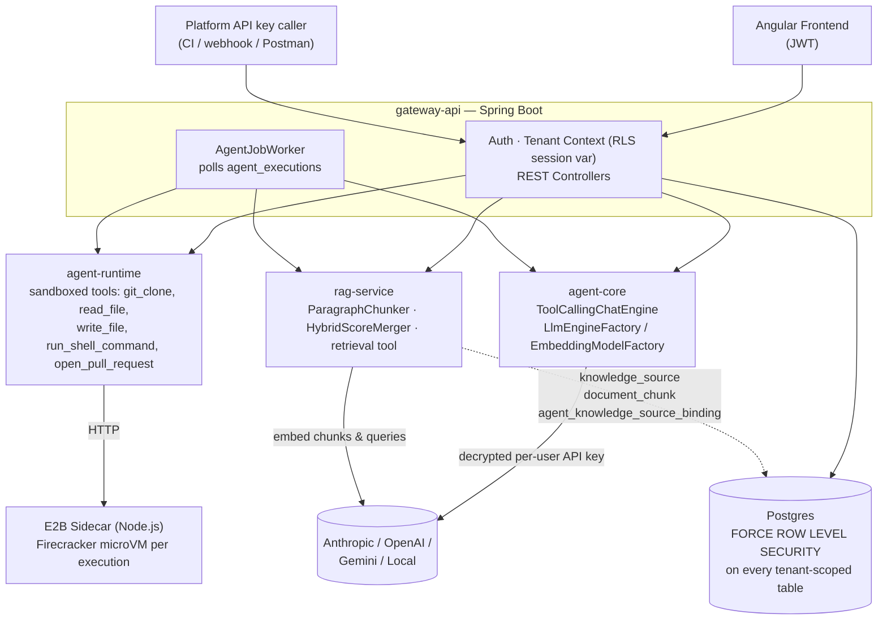

# Enterprise AI Agent Hub

## Why this exists

Every engineering org is being asked "can we let an LLM touch our codebase
safely?" — and most answers to that stop at a demo: a single-tenant script
with an API key in an environment variable and no real isolation story. This
project is my answer to what it takes to run that safely as a real product:
**multiple customers on shared infrastructure, each tenant's data
provably invisible to every other tenant, agents that don't just talk about
code but actually clone it, edit it, run it, and open real pull requests
inside a sandbox, and every one of those actions audited.** It's built the
way I'd want a system like this built if I were the one accountable for a
customer's credentials or their private repository ending up somewhere it
shouldn't.

Concretely, that means the parts of this repo worth a second look:

- **Multi-tenant isolation enforced at the database, not the application** —
  Postgres Row-Level Security on every tenant-scoped table, `FORCE`d so even
  the app's own connection role can't accidentally bypass it. This is the
  same isolation model real SaaS platforms (and their SOC 2 auditors) expect.
- **Agents that actually act, inside a real sandbox** — not chat-only demos.
  A ticket becomes a cloned repo, a code change, a re-run test suite, and a
  genuine GitHub pull request, with every tool call audited.
- **Credentials treated like credentials** — AES-256-GCM envelope encryption
  at rest, per-user vendor keys (never a shared tenant-wide secret), a
  fail-closed encryption key check at startup, and a documented trail of the
  real security bugs found and fixed along the way (see the bottom of this
  README) rather than a claim that nothing ever went wrong.
- **Retrieval-augmented generation as a first-class, multi-tenant capability**
  — not a bolted-on vector-search demo. See [RAG architecture](#rag-architecture)
  below.

If you're evaluating this for an engineering role: the interesting signal
isn't any single feature, it's the pattern repeated across all of them —
new capabilities plug into existing abstractions (RLS, the credential model,
the tool-calling contract) instead of each one inventing its own isolation
or security story. That consistency, and the discipline to document the
bugs found along the way instead of only the features shipped, is the part
meant to read as "how I'd actually build this at work," not just "a project
that runs."

## Architecture



`gateway-api` is the only Spring Boot application and the only module
allowed to depend on all the others — `agent-core`, `agent-runtime`, and
`rag-service` are plain library modules with their own narrow
responsibilities (LLM abstraction, sandboxed tool execution, retrieval),
each reusable independently of the web layer.

## Module layout

| Module | Responsibility |
|---|---|
| `common-dto` | Shared request/response contracts. No framework dependency. |
| `agent-core` | Provider-agnostic LLM + embedding abstraction (LangChain4j). Framework-light — no Spring dependency. |
| `agent-runtime` | Sandboxed tool execution via E2B microVMs (through an internal sidecar — see below). Five real tools: `RunShellCommandTool`, `GitCloneTool`, `ReadFileTool`, `WriteFileTool`, `OpenPullRequestTool`, all sharing one persistent per-execution sandbox (`SandboxSession`). |
| `rag-service` | Retrieval-augmented generation: paragraph-aware chunking, hybrid (vector + full-text) search, and the `retrieval` `AgentTool` — see [RAG architecture](#rag-architecture) below. |
| `gateway-api` | Spring Boot app: auth, tenant/user/credential management, agent invocation, and every REST controller (including `rag-service`'s knowledge-source endpoints). |

## Architecture notes

- **Tenant isolation is enforced by Postgres Row-Level Security**, not
  application-level `WHERE tenant_id = ?` filtering — every tenant-scoped
  table has an RLS policy keyed off a `app.current_tenant_id` session
  variable, set on every JDBC connection checkout by `TenantAwareDataSource`.
  `FORCE ROW LEVEL SECURITY` is set on every such table so this applies even
  to the app's own connection role, not just other Postgres roles.
  `platform_api_keys` is the one deliberate exception: its `SELECT` policy
  is open, because looking up a key by its hash is how the app discovers
  *which* tenant a caller belongs to in the first place — reads on that one
  table are scoped by the app code instead (see comments in
  `PlatformApiKeyRepository`).
- **3-role model**: `ADMIN` (users, vendor credentials, platform API keys,
  trigger agents, view history), `DEVELOPER` (trigger agents, view history),
  `READONLY` (view history only). Enforced via Spring Method Security
  (`@PreAuthorize`).
- **Vendor credentials are encrypted at rest** (AES-256-GCM) behind a
  `CredentialEncryptor` interface — `LocalAesGcmCredentialEncryptor` today,
  swappable for real AWS KMS/Vault later without touching call sites.
- **LLM access is provider-agnostic** via `LlmEngineFactory` in `agent-core`
  — given a tenant's decrypted credential, returns a LangChain4j
  `ChatLanguageModel` regardless of vendor. Only Anthropic is wired up so
  far.
- **Tools are our own interface** (`AgentTool`), not LangChain4j's
  reflection-based `@Tool` annotation — `agent-core` is the only module that
  knows LangChain4j exists; `agent-runtime`'s filesystem/terminal/git tools
  implement `AgentTool` directly, no LangChain4j import needed.
  `ToolCallingChatEngine` handles the actual tool-calling loop (bounded,
  multi-round — see below), and `SharedExecutionContext` is the object
  (tenant + LLM client + available tools) threaded through a single agent
  invocation. `AgentTool.execute()` takes an explicit `ToolExecutionContext`
  (tenantId, executionId) rather than a ThreadLocal — sandboxed execution
  goes over HTTP to a sidecar, and ThreadLocals don't survive a thread hop
  (the same bug class fixed in `TenantAwareDataSource`, this time for
  credential/compute access instead of a DB insert).
- **Tool-calling is multi-round and every sandboxed tool in one execution
  shares a single persistent sandbox.** `ToolCallingChatEngine` keeps
  sending tool results back and re-invoking the model — capped at
  `MAX_TOOL_ROUNDS` (6) to bound cost/runaway loops — instead of stopping
  after one round of tool calls. That alone isn't enough for a real coding
  task, though: each `AbstractSandboxedTool` still provisions its own
  sandbox by default, so a `git_clone` followed by a `read_file` in the
  *next* round would find an empty, brand-new sandbox with nothing cloned
  into it. `SandboxSession` (agent-runtime) fixes this — a decorator around
  `SandboxClient` that intercepts every tool's own `create()`/`destroy()`
  calls: the first tool to touch the sandbox in an execution actually
  provisions one (using every credential kind `AgentPromptRunner` resolved
  up front, since E2B only accepts env vars at creation time — a tool that
  runs later in the sequence can't inject its own), every subsequent tool
  call in that execution reuses the same handle, and the real teardown only
  happens once, in `AgentPromptRunner`'s `finally` block, after the whole
  multi-round loop finishes. No changes needed to `RunShellCommandTool` or
  `GitCloneTool` themselves for this — they still believe they own a
  private sandbox each time. `RunShellCommandTool` also now runs from the
  shared workspace directory (`Workspace.ROOT`, `/tmp/workspace/repo`) so
  it naturally sees whatever `GitCloneTool` cloned earlier in the same run.
  Verified live: clone → read a file → write a new file → shell-`cat` that
  file back, all in one prompt, each step correctly seeing the previous
  step's filesystem state.
- **Agents come from a catalog, not a hardcoded list** — the actual
  mechanism behind "a library of hundreds of agents and tools." An
  `AgentDefinition` (`agent_definitions` table, platform-wide, not
  tenant-scoped) is a named persona: a system prompt plus a curated
  `tool_names` list. `ToolCatalog` (gateway-api) is the tool-side registry
  it references — every `AgentTool` gets one `@Component ToolFactory` bean
  (`toolName()` + `create(session, listener, credentialResolver)`), and
  `ToolCatalog` self-assembles from whatever `ToolFactory` beans Spring
  finds. Adding tool #101 means one new `AgentTool` + one new
  `ToolFactory`; adding agent #101 means one new `agent_definitions` row
  (via migration for now — no admin CRUD API yet). `AgentPromptRunner`
  resolves a definition by slug, builds only ITS tools via the catalog,
  and only resolves credentials for kinds a tool it's actually using might
  need (e.g. `GIT`, only if `git_clone` is in that definition's tool
  list). `GET /agents/definitions` lists the current catalog. Two seeded
  definitions exist today: `general-assistant` (no repo access) and
  `ticket-resolver` (all five sandboxed tools). Verified live: the same
  clone → read prompt behaves completely differently depending on which
  agent it's sent to — `general-assistant` correctly reports it has no
  cloning capability at all, `ticket-resolver` clones and quotes the real
  file content back.
- **The Ticket-to-PR loop actually closes now**: `OpenPullRequestTool`
  commits whatever's in the shared workspace, pushes it to a new branch,
  and opens a real pull request via GitHub's REST API (a new `GITHUB`
  `tool_credentials` kind, same encrypted-storage pattern as `GIT` — a PAT
  with repo/PR scope). The interesting design decision: `testCommand` is
  a **required** argument, not optional, and the tool re-runs it *itself*,
  for real, inside the sandbox, immediately before doing anything else —
  if it exits non-zero, no branch is created, nothing is committed or
  pushed, and no PR is opened, no matter what the model's tool call
  claims should happen. This doesn't trust the model's self-report of
  "I tested it"; it trusts an actual exit code, the same posture RLS
  takes for tenant isolation (enforce it at the point that matters, not
  the caller) and `RunShellCommandTool` takes for command results (real
  exit codes, never assumed success). `ticket-resolver`'s tool list and
  system prompt were updated (migration `V7`) to actually use it that
  way, not just have it available.
- **Server-resolved input, not model-invoked**: `InputSourceResolver`
  (`gateway-api`) generalizes "feed an agent a ticket/log/pasted text"
  the same way `CredentialResolver` generalized credentials — a
  deterministic server-side step, never a tool the LLM decides to call
  (same posture as `OpenPullRequestTool`'s mandatory `testCommand`: an
  agent shouldn't be able to choose not to read what it was triggered
  for). `AgentDefinition.inputSourceType` (migration `V8`) declares which
  resolver a definition needs; `InputSourceResolverRegistry`
  self-assembles from `@Component InputSourceResolver` beans the same way
  `ToolCatalog` self-assembles from `ToolFactory` beans. First (and so
  far only) implementation: `ManualTextInputResolver`, where the "source"
  is just text passed directly in the trigger request — enough to prove
  the whole pipeline without waiting on a real Jira integration.
  `TriggerAgentExecutionRequest` grew two **additive** fields,
  `repositoryUrl` and `inputParameters` (a flat string map, so adding
  resolver #2 never reshapes this DTO again) — both optional, and an
  `AgentDefinition` with no `inputSourceType` (`general-assistant`,
  `ticket-resolver` today) ignores them entirely. `AgentPromptRunner`
  assembles the final prompt as whichever of `"Repository: {url}"`, the
  resolved input blob, and the free-text `prompt` are non-blank, joined
  with a blank line, in that order — verified to reduce to byte-identical
  behavior when neither new field is used.
- **Per-tenant execution concurrency cap**: `AgentExecutionService.enqueue()`
  rejects (`429`, before persisting anything) once the calling tenant
  already has `app.execution.max-concurrent-per-tenant` (default 5, env
  `MAX_CONCURRENT_EXECUTIONS_PER_TENANT`) executions `QUEUED`/`RUNNING` —
  a single low default shared by every tenant today, not yet a
  per-tenant-tier setting, but reusing `app.execution`'s existing
  namespace keeps that upgrade path open. Protects a metered
  E2B/Anthropic account from a bug, a misbehaving agent loop, or repeated
  clicking, not from a deliberately hostile tenant (RLS, not this, is the
  isolation boundary). Every rejection is logged at WARN with the
  tenant id and current count — a tenant that regularly hits the ceiling
  is a real product signal worth seeing, not just an error to swallow.
- **Per-agent required inputs, not a hardcoded field check**:
  `AgentDefinition.requiredInputs` (migration `V10`, same array-column
  pattern as `tool_names`) replaces what used to be a single ad hoc
  `"prompt is required"` check in `AgentExecutionController`. A fixed
  vocabulary — `"prompt"`, `"repositoryUrl"`, `"inputParameters:{key}"`
  (e.g. `"inputParameters:ticketKey"`) — lets a definition declare
  exactly which combination it needs; `AgentExecutionService.enqueue()`
  resolves the definition (already loading it for the slug check anyway),
  collects **every** unmet requirement rather than failing on the first,
  and rejects with `400` and a message listing all of them:
  `"Missing required input(s): repositoryUrl, inputParameters.ticketKey"`.
  `general-assistant` requires `prompt`; `ticket-resolver` requires
  `repositoryUrl`. An unrecognized requirement string on a definition row
  is treated as a data-integrity problem (500), the same posture as
  `ToolCatalog`'s unknown-tool-name error, not a caller mistake.
- **A genuine cross-origin browser client, for the first time**: every
  caller before the Angular frontend was non-browser (Postman, CI), so
  `SecurityConfig` never needed CORS rules. `CorsProperties` (`app.cors.allowed-origin`,
  env `CORS_ALLOWED_ORIGIN`) is deliberately a single configurable origin,
  never a wildcard — a wildcard combined with credentialed requests
  (`Authorization` headers) would undercut the tenant-isolation discipline
  the rest of this system is careful about. `GET/POST/PUT/PATCH` and
  `Authorization`/`Content-Type` headers only. Live-verified with real
  preflight (`OPTIONS`) requests against the actual filter chain, not just
  a config-object unit test.
- **Credential health and live validation**: `VendorCredential`/`ToolCredential`
  gained `lastUsedAt` (migration `V11`, stamped on every real resolve —
  `VendorCredentialService.decryptToken()`/`ToolCredentialService.decryptActiveValue()`,
  i.e. an actual agent run used it) and `lastValidatedAt` (stamped only by
  an explicit `POST /vendor-credentials/test` or `/tool-credentials/test`
  call). The "cheap" Anthropic check is still a real, tiny, billed API
  call — there's no free way to validate a key short of using it. The
  GitHub check confirms validity only, not repo/PR scope (fine-grained
  PATs don't expose that cheaply); `GIT` credentials skip test-connection
  entirely (no fixed target to validate a generic clone credential
  against).
- **Team management now actually onboards someone**: `POST /users` no
  longer accepts a caller-supplied password (migration `V12` also adds
  `AppUser.name`) — `TempPasswordGenerator` generates one server-side and
  `MailService` emails it via Brevo's SMTP relay, **before** the user row
  is persisted. That ordering is deliberate: if email delivery fails,
  account creation aborts entirely (502) rather than leaving a real,
  usable account whose password nobody — not the admin, not the new user —
  has any way to learn. `application-test.yml`'s `test` profile swaps in
  an inert mock `JavaMailSender` (`TestMailConfig`) so `mvn test` never
  attempts a real SMTP connection with placeholder Brevo credentials.
- **Sandboxed tool execution is vendor-neutral at the API boundary**:
  `SandboxClient` (`agent-runtime`) knows nothing about E2B specifically —
  `SandboxClientHttpImpl` calls an internal HTTP sidecar
  (`agent-runtime/sidecar/`, Node + E2B's official JS SDK, since E2B has no
  official Java SDK and its gRPC data-plane protocol isn't a documented
  external contract) rather than a hand-rolled Java gRPC client. Every
  execution gets a fresh, ephemeral sandbox (verified: state from one
  execution is genuinely invisible to the next), with an enforced timeout,
  output-size cap, and a scoped credential injected only where needed.
  Every sandboxed tool call is audited to `tool_executions`
  (`AbstractSandboxedTool` → `ToolExecutionListener` SPI →
  `JpaToolExecutionListener`), RLS-scoped like everything else.
- **Git operations run inside the sandbox too, never in-process** —
  `GitCloneTool` runs `git clone` as a sandboxed shell command via
  `SandboxClient`, the same way `RunShellCommandTool` does. `agent-runtime`
  deliberately has no JGit dependency: an in-process git library would
  clone LLM-directed, potentially-untrusted repository content directly
  onto our own host, defeating the sandbox entirely. It's also the first
  tool to use `CredentialResolver` (a dedicated `tool_credentials` table,
  separate from `vendor_credentials` — a git PAT has a different
  rotation/scoping story than an LLM API key) — the credential is injected
  as a sandbox env var and applied via `git -c http.extraHeader=...`
  rather than embedded in the clone URL, so it's never written to the
  cloned repo's own `.git/config`.
- **Agent execution is a real, durable, DB-backed job queue**
  (`POST /agents/execute` → `GET /agents/executions/{id}`), not just the
  synchronous spike endpoints. `agent_executions` (a Week 1 table that sat
  unused until now) is the queue itself: `AgentJobWorker` polls it with
  `SELECT ... FOR UPDATE SKIP LOCKED` (`AgentExecutionRepository.claimNextQueued`),
  durable across restarts and safe under multiple concurrent workers/app
  instances with no message broker needed at this scale. The one wrinkle:
  the worker is a system component, not acting for any one tenant, so it
  needs to see QUEUED rows across every tenant to claim one — rather than
  a second Postgres role with `BYPASSRLS` (a much bigger, harder-to-audit
  escape hatch), `agent_executions`' RLS policy has a narrow OR clause
  recognizing one reserved sentinel value (`TenantContext.SYSTEM_WORKER_TENANT_ID`)
  that only `AgentJobWorker` ever sets, and only for the claim step — it
  switches to the job's real tenant id before doing anything else (running
  the prompt, resolving credentials, sandboxed tool execution, audit
  logging), so everything past the claim is exactly as tenant-scoped as a
  real request. `AgentPromptRunner` holds the actual "run this prompt with
  tools for this tenant" logic, extracted out of `AgentPingService` so the
  synchronous spike and the async worker share one implementation instead
  of two copies drifting apart. See `CODE_WALKTHROUGH.md` for the full
  claim → run → complete call stack.

**Two real bugs were caught by live-testing `GitCloneTool` against actual
E2B infrastructure** (not by unit tests, which all passed throughout —
mocks can't catch either of these): E2B's SDK throws rather than returning
a result when a sandboxed command exits non-zero, which the sidecar was
originally turning into a fake 502 "infrastructure failure" instead of the
real exit code/stdout/stderr; and `/workspace` at the sandbox's filesystem
root isn't writable by its default user (`/tmp` is). Both fixed, both now
covered by tests that lock in the corrected behavior.

## RAG architecture

A tenant uploads documents into a `knowledge_source` (`POST /knowledge-sources`,
`POST /knowledge-sources/{id}/documents`); any `AgentDefinition` can then be
bound to one via a per-tenant `agent_knowledge_source_binding` row
(`PUT /knowledge-sources/{id}/agent-bindings/{agentSlug}`, ADMIN-only), which
is what "attach a knowledge source to an agent via config, without writing
new code" actually means here — a data row, not a deploy. Once bound, that
agent gets a `retrieval` tool it can call mid-execution (`ticket-resolver`
does today, see `V31__ticket_resolver_retrieval_tool.sql`) the same way it
calls `git_clone` or `read_file` — through the same `AgentTool` contract,
no special-casing anywhere in `ToolCallingChatEngine`.

**Why hybrid search, not vector search alone.** Vector similarity finds
semantically related passages even when the wording is completely
different — genuinely useful for "how does this codebase handle X"-style
questions. But it can miss a query that hinges on one exact term: an error
code, a specific function name, a config key — the kind of query full-text
search is precise on and paraphrase-based vector search sometimes isn't.
Combining both signals (`DocumentChunkRepository`'s two native queries —
pgvector's `<=>` cosine-distance operator, and Postgres `ts_rank` over a
`to_tsvector` GIN index) and merging them in `HybridScoreMerger` covers more
real queries than either alone. The two signals live on completely
different, incomparable numeric scales, so each is min-max normalized to
`[0, 1]` **within its own candidate set** before being combined with a
configurable weight — a chunk that only appears in one candidate set still
contributes its full normalized score for that signal rather than being
dropped, since it still had a real hit.

**Why paragraph-aware chunking, not fixed-size splitting.** Splitting a
document every N characters is simpler and perfectly index-friendly, but it
routinely severs a sentence — or an entire idea — mid-thought at an
arbitrary offset. An embedding computed over half a sentence glued to the
unrelated start of the next one is a measurably worse semantic
representation than embedding either sentence whole, and a chunk shown as a
citation that begins or ends mid-word reads as broken to whoever's reading
it. `ParagraphChunker` splits on paragraph boundaries first, only falling
back to sentence boundaries for a single paragraph that alone exceeds the
chunk budget, with a configurable character overlap carried from one
chunk's tail into the next chunk's start — so a sentence that happens to
fall right on a chunk boundary still appears whole in at least one chunk.
It costs more implementation complexity than a one-line substring loop and
produces variable-sized chunks instead of uniform ones, in exchange for
each chunk staying a coherent unit of meaning.

**How tenant isolation is inherited, not reimplemented.** `knowledge_source`,
`document_chunk`, and `agent_knowledge_source_binding` all follow the exact
same pattern as every other tenant-scoped table in this schema: a
`tenant_id` column, `ENABLE` + `FORCE ROW LEVEL SECURITY` together, and a
`tenant_isolation_<table>` policy keyed off
`current_setting('app.current_tenant_id')`. Nothing in `rag-service` sets
that session variable itself — `TenantAwareDataSource` (`gateway-api`)
already does it on every JDBC connection checkout for the app's one shared
`DataSource`, and `rag-service`'s Spring Data repositories run through that
exact same `DataSource`. The moment `document_chunk` had `FORCE ROW LEVEL
SECURITY`, tenant isolation for it was already correct, with zero new
session-scoping code — the same reason `rag-service` could be added as a
persistence-owning module at all despite being new: `GatewayApplication`'s
`scanBasePackages = "com.enterprisehub"` already covers it.

**Embeddings are tenant-funded, like every other LLM call here.** Anthropic
has no embeddings API, so `EmbeddingModelFactory` (`agent-core`, sibling to
`LlmEngineFactory`) only implements `OPENAI` and `GEMINI` — resolved from
the *triggering user's own* vendor credential (`EmbeddingProviderResolver`,
OpenAI checked first), never a platform-wide key, matching the BYO-key model
every other LLM call in this app already uses. Both providers are coerced to
the same 768-dimension output (`OpenAiEmbeddingModel`'s `dimensions`
parameter, Gemini's native size) so `document_chunk.embedding` can be one
fixed `vector(768)` column regardless of which vendor actually produced a
given row.

## Setup

Requires a local Postgres instance and a dedicated app role (never the
Postgres superuser — RLS is silently ignored for superusers/BYPASSRLS
roles):

```sql
CREATE ROLE hub_user LOGIN PASSWORD 'password';
CREATE DATABASE agent_hub OWNER hub_user;
CREATE DATABASE agent_hub_test OWNER hub_user;  -- used by integration tests only
```

Override `DB_URL` / `DB_USERNAME` / `DB_PASSWORD` (see `application.yml`) if
you're not using these exact local defaults. `JWT_SECRET` and
`CREDENTIAL_LOCAL_KEY` also have dev-only defaults baked in — override both
in any shared/production environment.

RAG features need the `pgvector` extension **installed by a superuser**,
once per database, before `hub_user` (or any non-superuser role) ever
connects — confirmed against a real `pgvector/pgvector:pg16` instance:
`hub_user` gets `permission denied to create extension "vector"` even
though it owns `agent_hub`, so `V28__enable_pgvector.sql`'s own
`CREATE EXTENSION IF NOT EXISTS vector` can only ever *confirm* it's already
there, never actually install it — same posture as `hub_user` never being
the Postgres superuser above. As the `postgres` superuser (`docker-compose`'s
`init.sh` does this automatically for the docker path):

```sql
\c agent_hub
CREATE EXTENSION IF NOT EXISTS vector;
\c agent_hub_test
CREATE EXTENSION IF NOT EXISTS vector;
```

The extension binary itself still needs to be present on the server first if
you're not using `docker-compose`'s `pgvector/pgvector` image — most managed
Postgres providers (RDS 15.2+, Supabase, Neon, Timescale) ship it, but a
plain local Postgres install needs the OS package for your Postgres version
(e.g. `postgresql-16-pgvector` on Debian/Ubuntu, `brew install pgvector` on
macOS) before the `CREATE EXTENSION` above will find it.

For sandboxed tool execution (`RunShellCommandTool`, `GitCloneTool`,
`ReadFileTool`, `WriteFileTool`, `OpenPullRequestTool` — reached via
`/agents/ping-with-tools` or `/agents/execute`), the sidecar also needs
to be running — see
[`agent-runtime/sidecar/README.md`](agent-runtime/sidecar/README.md).
Quick version: `cd agent-runtime/sidecar`, set a real `E2B_API_KEY` in
`.env`, `npm start` (or `docker build`/`docker run` — both verified
working). Without it, `/agents/ping-with-tools` still works for prompts
that don't need the shell command tool; it only fails (502) if the model
tries to use it.

`AgentJobWorker` (the `/agents/execute` queue poller) runs automatically
on startup — `JOB_WORKER_ENABLED=false` disables it entirely (no bean at
all) if you want to inspect `agent_executions` rows without a background
process racing you; `JOB_WORKER_POLL_INTERVAL_MS` controls how often it
polls (default 2000ms).

## Build

```bash
mvn clean install
```

## Run (gateway-api)

```bash
cd gateway-api
mvn spring-boot:run
```

Flyway migrates `agent_hub` automatically on startup. First request should
be registering a tenant:

```bash
curl -X POST localhost:8080/auth/register \
  -H "Content-Type: application/json" \
  -d '{"tenantName":"Acme","tenantSlug":"acme","email":"admin@acme.com","password":"password123"}'
```

The response includes a JWT — use it as `Authorization: Bearer <token>` on
every other endpoint. A full request collection covering every endpoint
(including negative cases like RBAC denials and cross-tenant isolation) is
in [`postman/enterprise-ai-agent-hub.postman_collection.json`](postman/enterprise-ai-agent-hub.postman_collection.json) — import it into Postman.

## API surface (so far)

| Endpoint | Auth | Purpose |
|---|---|---|
| `POST /auth/register` | none | Create a tenant + its first (ADMIN) user |
| `POST /auth/login` | none | Get a JWT |
| `POST /users` | ADMIN | Create a team member in the caller's own tenant. No password in the request — a temporary one is generated server-side and emailed via Brevo SMTP (`MailService`), never returned in the response (same "never show a secret back" discipline as `VendorCredentialSummary`). Email delivery happens **before** the row is persisted — if it fails, account creation aborts entirely (502) rather than leaving a user with a password nobody can learn. |
| `GET /users` · `PATCH /users/{id}/role` · `DELETE /users/{id}` | ADMIN | List/re-role/remove a tenant's users. Guards against demoting or deleting a tenant's last remaining ADMIN. |
| `POST /api-keys` · `GET /api-keys` · `DELETE /api-keys/{id}` | ADMIN | Issue/revoke platform API keys (for future CI/CD & webhook triggers) |
| `PUT /vendor-credentials` · `GET /vendor-credentials` · `DELETE /vendor-credentials/{provider}` | ADMIN | Store/rotate/remove encrypted LLM vendor credentials. Summaries now include `lastUsedAt` (stamped on every real resolve, e.g. an agent run) and `lastValidatedAt` (stamped only by an explicit test-connection call below). |
| `POST /vendor-credentials/test` | ADMIN | Live-validates a stored vendor credential — for `ANTHROPIC`, a real (tiny, billed) `messages.create` call; other providers return `{valid: false, message: "not supported yet"}` since only Anthropic is wired up (see `LlmEngineFactory`). Never returns the credential value; stamps `lastValidatedAt` on success. |
| `PUT /tool-credentials` · `GET /tool-credentials` · `DELETE /tool-credentials/{credentialKind}` | ADMIN | Store/rotate/remove encrypted credentials sandboxed tools need — `credentialKind` is `GIT` (clone auth) or `GITHUB` (a PAT with repo/PR scope, used by `OpenPullRequestTool`). Same `lastUsedAt`/`lastValidatedAt` fields as vendor credentials. |
| `POST /tool-credentials/test` | ADMIN | Live-validates a stored tool credential — `GITHUB` only (`GET /user` against GitHub's API, confirms the token is valid/unrevoked, deliberately does **not** confirm repo/PR scope — fine-grained PATs don't expose that cheaply). `GIT` returns `{valid: false, message: "not supported yet"}` — no fixed target to validate a generic clone credential against. |
| `POST /agents/ping` | ADMIN, DEVELOPER | Spike endpoint: real round-trip to the tenant's configured LLM, proves the credential → LangChain4j → provider chain works. Not the real agent execution model. |
| `POST /agents/ping-with-tools` | ADMIN, DEVELOPER | Spike endpoint: runs a named `AgentDefinition` (`agentSlug` in the body, defaults to `general-assistant`) synchronously through `SharedExecutionContext` — proves the full multi-round tool-calling loop, real sandbox execution (via `SandboxSession` and whichever tools that agent's definition includes), and audit logging all work end to end. A prompt that chains several steps (e.g. "clone, then read the README, then write a new file, then cat it") works in one request now, as long as the chosen agent's tool list includes what it needs. |
| `POST /agents/execute` | ADMIN, DEVELOPER | The real (durable, async) execution model: enqueues an `agent_executions` row (`QUEUED`, tagged with the resolved `agentSlug`) and returns its id immediately — `202 Accepted` — without waiting for the LLM or any tool. `AgentJobWorker` picks it up separately. Rejects an unknown/inactive `agentSlug` immediately (400), before persisting anything. `repositoryUrl`/`inputParameters` are optional — see the input source abstraction note above; both no-ops for an `AgentDefinition` with no `inputSourceType`. Rejects with `400` listing every unmet requirement (e.g. `"Missing required input(s): repositoryUrl"`) per that agent's own `requiredInputs` — see the generalized required-inputs note above. Rejects with `429` (before persisting) once the calling tenant already has `app.execution.max-concurrent-per-tenant` (default 5) executions `QUEUED`/`RUNNING`. |
| `GET /agents/executions/{id}` | ADMIN, DEVELOPER, READONLY | Poll a queued/running/finished execution's current status, and once `SUCCEEDED`/`FAILED`, its reply/error. Response now also includes `repositoryUrl`/`inputParameters`. Tenant-isolated the same way as everything else (RLS + an explicit `tenant_id` filter). |
| `GET /agents/executions` | ADMIN, DEVELOPER, READONLY | Tenant-scoped, paginated (`?page=0&size=20&sort=createdAt,desc`), optional `?status=` filter. Returns `PagedModel<AgentExecutionStatusResponse>`, not a raw `Page` — `Page`'s own JSON shape depends on which Jackson modules happen to be registered, `PagedModel` doesn't. |
| `GET /agents/executions/usage` | ADMIN, DEVELOPER, READONLY | `{active, limit}` — lets a caller see remaining concurrency-cap capacity before submitting a trigger request. Same count `POST /agents/execute`'s own rejection check uses, so the two can never drift apart. A literal path segment ahead of `/agents/executions/{id}` in the URL space — Spring's routing resolves path specificity correctly regardless of declaration order, verified by a dedicated regression test. |
| `GET /agents/executions/{id}/tool-executions` | ADMIN, DEVELOPER, READONLY | The ordered tool-call trace for one execution (tool name, duration, outcome, error if any) — what a skeptical teammate opens to verify what an agent actually did. 404s if the execution itself doesn't exist or belongs to another tenant. |
| `GET /agents/definitions` | ADMIN, DEVELOPER, READONLY | The browsable agent catalog — slug, name, description, and tool list for every active `AgentDefinition`. This is how a caller discovers what `agentSlug` values are valid. |
| `GET /agents/definitions/{slug}` | ADMIN, DEVELOPER, READONLY | Full, **read-only** configuration for one definition — system prompt, tool list, `inputSourceType`, `requiredInputs`. "View configuration" on a catalog card, not an edit form; `AgentDefinition` still has no admin CRUD API, this is browsing only. |
| `POST /knowledge-sources` · `GET /knowledge-sources` | ADMIN, DEVELOPER | Create/list a tenant's RAG knowledge sources (`name` + `sourceType`: `upload`/`url`/`repo`, only `upload` implemented today). |
| `POST /knowledge-sources/{id}/documents` | ADMIN, DEVELOPER | Multipart upload (`file`, PDF or plain text) — synchronously extracts text, chunks it (`ParagraphChunker`), embeds every chunk (batched, tenant's own OpenAI/Gemini credential), and stores it. Returns the chunk count. |
| `POST /knowledge-sources/{id}/query` | ADMIN, DEVELOPER | Direct hybrid-search query against one knowledge source, for testing/debugging outside of an agent run — same `RetrievalQueryService` an agent's `retrieval` tool call uses. Returns ranked chunks with source document name and relevance score. |
| `PUT /knowledge-sources/{id}/agent-bindings/{agentSlug}` · `DELETE .../agent-bindings/{agentSlug}` | ADMIN | Attach/detach a knowledge source to/from an `AgentDefinition` for the caller's tenant — see [RAG architecture](#rag-architecture). |
| `GET /actuator/health` | none | Health check |

## Test

```bash
mvn test
```

Integration tests (`@SpringBootTest`, tagged `@ActiveProfiles("test")`) run
against `agent_hub_test`, a **separate** database, so test runs never
create or leave behind data in the dev DB (`agent_hub`). Flyway migrates it
automatically on first test run, same as the dev DB.

585 automated tests as of the last update (54 `agent-core` + 110
`agent-runtime` + 17 `rag-service` + 404 `gateway-api`) — unit tests (mocked) for every
service/security/util class, plus integration tests that boot the real
Spring context, real security filter chain, and real Postgres RLS to catch
the class of bug mocks can't (e.g. cross-tenant isolation, RBAC denials,
audit-table RLS, and the RLS-enforcement bugs described below).
`AgentExecutionQueueIntegrationTest` is the one covering the job queue
itself: the RLS worker-sentinel carve-out actually lets a claim see jobs
across tenants (and nothing else does), the claim → complete lifecycle,
and `GET /agents/executions/{id}`'s tenant isolation — all against real
Postgres, not mocks. `SandboxSessionTest` and `AgentPromptRunnerTest`'s
`run_multipleSandboxedToolCallsInOneRun_shareOneSandbox_destroyedOnce`
cover the persistent-sandbox behavior; `ToolCallingChatEngineTest` covers
the multi-round loop, including the max-rounds cap; `ToolCatalogTest` and
`AgentPromptRunnerTest`'s definition-resolution cases (unknown slug
rejected, credentials only resolved for tools actually in the
definition, system prompt passed through) cover the agent catalog.
`OpenPullRequestToolTest` covers the test-gate specifically: a failing
`testCommand` never reaches the git/push/curl steps at all (verified via
a mock call-count assertion, not just a returned message).
`ParagraphChunkerTest` and `HybridScoreMergerTest` (`rag-service`) cover the
chunking and hybrid-rerank logic as pure functions, no DB needed —
`RetrievalEvalTest` is a separate retrieval-quality eval (not a correctness
test), skipped unless a real `OPENAI_API_KEY` is set:

```bash
OPENAI_API_KEY=sk-... mvn -pl rag-service test -Dtest=RetrievalEvalTest
```

It chunks and embeds a small fixture document set, runs 10 questions against
it through the real chunker and hybrid merger, and prints a precision@3
report — see the class javadoc for why it computes candidates in memory
rather than against a live Postgres.

Two additional manual integration tests exist for `agent-runtime`
(`*ManualIT` naming — excluded from `mvn test` by Surefire's default
pattern, gated behind `SANDBOX_SIDECAR_URL` besides), verified passing
against a real E2B account both via a directly-run sidecar and the
Dockerized one -- including the sidecar bugfix described above, which was
found through exactly this kind of real-infrastructure test, not a mock:

```bash
SANDBOX_SIDECAR_URL=http://localhost:8090/ mvn test -pl agent-runtime -Dtest=RunShellCommandToolManualIT
```

## Status

Following a self-imposed weekly build plan (~3.5h/day, 5 days/week):

- [x] **Week 1** — Multi-module Maven skeleton, RLS-backed tenant schema, stateless security baseline
- [x] **Week 2** — JWT auth, register/login, platform API key issuance
- [x] **Week 3** — Role-based `@PreAuthorize`, KMS-style (local AES-GCM) credential encryption
- [x] **Week 4** — `LlmEngineFactory` + real Anthropic round-trip proof (`/agents/ping`)
- [x] **Week 5** — `SharedExecutionContext`, `AgentTool` interface, tool-calling loop proven live (`/agents/ping-with-tools`)
- [x] **Weeks 6–8 (started)** — `SandboxClient` abstraction, E2B-backed sidecar (verified against real infra, Node-direct and Dockerized), `RunShellCommandTool` + `GitCloneTool` reachable end to end (`/agents/ping-with-tools` → real E2B sandbox → audited to `tool_executions`, RLS-scoped). Dedicated `tool_credentials` table + `CredentialResolver` real implementation for tool-specific credentials (git PAT). Filesystem tools not started.
- [x] **Weeks 9–10** — Durable job orchestration: `POST /agents/execute` / `GET /agents/executions/{id}`, backed by a DB-polling queue (`AgentJobWorker` + `SELECT ... FOR UPDATE SKIP LOCKED` against `agent_executions`, no message broker needed at this scale — see the architecture notes above for the RLS worker-sentinel design). Verified live against the real dev DB: a queued job was picked up and completed by the background poller with no manual trigger involved.
- [x] **Single-agent execution depth** (groundwork for the planned multi-agent "Ticket → PR" pipeline — see below) — `SandboxSession` gives one execution a persistent sandbox instead of a fresh one per tool call, `ToolCallingChatEngine` is now a bounded multi-round loop instead of one shot, and `ReadFileTool`/`WriteFileTool` round out the tool set alongside `RunShellCommandTool`/`GitCloneTool`. Verified live: clone → read → write → shell-verify, all in one prompt, each step seeing the last one's state.
- [x] **Agent catalog** (the substrate "a library of hundreds of agents and tools" is built on) — `AgentDefinition` (platform-wide, named persona + curated tool list) and `ToolCatalog` (self-assembling `ToolFactory` registry) replace the hardcoded tool list `AgentPromptRunner` used to build every time. Two seeded agents (`general-assistant`, `ticket-resolver`), `GET /agents/definitions` to browse them, `agentSlug` on both trigger endpoints. Verified live: the identical clone+read prompt behaves correctly differently depending on which agent it's sent to. No admin CRUD API yet — new agents are added via migration, same as new tools are added via code.
- [x] **The Ticket-to-PR loop closes**: `OpenPullRequestTool` — commit, push, open a real GitHub pull request, gated on its own `testCommand` argument being mandatory and independently re-verified inside the sandbox (never trusts the model's say-so that it tested anything). New `GITHUB` `tool_credentials` kind. `ticket-resolver`'s tool list and system prompt updated (migration `V7`) to actually use it. **Live-verified end to end** against a real private GitHub repo: `git_clone` → `write_file` → `open_pull_request` → a real pull request opened via the GitHub REST API. Getting there surfaced a real sidecar bug — see the history note below.
- [x] **Input source abstraction** (groundwork for a second real agent, log-to-fix-PR, alongside ticket-to-PR) — `InputSourceResolver`/`InputSourceResolverRegistry` (`gateway-api`) let an `AgentDefinition` declare an `inputSourceType` (migration `V8`) instead of every triggerable agent needing bespoke input plumbing; `ManualTextInputResolver` is the first (simplest) implementation. `TriggerAgentExecutionRequest` gained `repositoryUrl` + `inputParameters`, both additive/optional — `AgentPromptRunner` assembles `"Repository: {url}"` + resolved blob + free-text `prompt`, skipping blank sections, verified byte-identical to prior behavior when neither is used. Unit-tested only so far (not yet live-verified against the running app with a real trigger request).
- [x] **Per-tenant execution concurrency cap** — `AgentExecutionService.enqueue()` rejects with `429` (before persisting anything) once a tenant already has `app.execution.max-concurrent-per-tenant` (default 5) executions `QUEUED`/`RUNNING`, logged at WARN. Protects a metered E2B/Anthropic account from a bug or a misbehaving loop, not from a hostile tenant (RLS remains the isolation boundary). A flat number today, not a per-tenant-tier setting — deliberately not built yet, just left room for it.
- [x] **Generalized per-agent required inputs** — `AgentDefinition.requiredInputs` (migration `V10`) replaces the old hardcoded `"prompt is required"` check with a fixed vocabulary (`prompt`, `repositoryUrl`, `inputParameters:{key}`) a definition declares against; `AgentExecutionService.enqueue()` collects every unmet requirement and rejects with `400` listing all of them, not just the first. `general-assistant` requires `prompt`, `ticket-resolver` requires `repositoryUrl`.
- [x] **Backend additions for the Angular frontend** — built ahead of the frontend itself, per its own build order: CORS (one configurable origin, never a wildcard, live-verified with real preflight requests); credential health (`lastUsedAt`/`lastValidatedAt`, migration `V11`) plus live test-connection endpoints for `ANTHROPIC` (real billed API call) and `GITHUB` (validity-only check); `GET /agents/definitions/{slug}` for read-only "view configuration"; paginated `GET /agents/executions` (as `PagedModel`, not a raw `Page`) with `repositoryUrl`/`inputParameters` added to the status response; `GET /agents/executions/{id}/tool-executions` for the ordered tool-call trace; `GET /agents/executions/usage` for a "N / limit" indicator; and `POST /users` now generates + emails a temporary password via Brevo SMTP instead of accepting one from the caller (migration `V12` adds `AppUser.name`). All fully unit- and integration-tested, live-verified against real Postgres.
- [x] **`coding-agent` renamed and repurposed to `ticket-resolver`** (migration `V13`) — a focused Ticket-to-PR persona (explicit ROLE/SCOPE/PROCESS/HARD CONSTRAINTS/STOP CONDITION system prompt) instead of a generic "can use git tools" one. `requiredInputs` is now `['repositoryUrl', 'prompt']` (both, not just `repositoryUrl`) — the ticket description is pasted as the free-text `prompt`; no live Jira API integration exists (that would need a new `ToolCredentialKind` and a real `InputSourceResolver` hitting Jira's REST API — deliberately out of scope). Also raised `ToolCallingChatEngine.MAX_TOOL_ROUNDS` from 6 to 14: the new prompt's own "one corrected attempt if tests fail" policy needs a read/write/retry cycle on top of the ~5 rounds a first-try clone→explore→fix→PR already takes, and 6 was measured too tight for that combined shape (the round cap would hit mid-retry, forcing a text-only answer with no tool calls left instead of a real PR or a clear stop reason).
- [x] **Second agent: `test-fixer`** (migration `V16`) — proactive rather than ticket-driven: given only a repository, it discovers its own test command (no assumed stack — investigates `package.json`/`pom.xml`/`requirements.txt`/`go.mod`/etc. itself rather than guessing), runs the suite, and fixes genuine failures one at a time, explicitly reasoning about whether the SOURCE or the TEST ITSELF is stale before touching anything, re-running the FULL suite after each individual fix. Reuses `ticket-resolver`'s exact tool set — no new tools needed. `requiredInputs` is just `['repositoryUrl']` (`prompt` stays optional, for extra guidance). Raised `ToolCallingChatEngine.MAX_TOOL_ROUNDS` from 14 to 30: this prompt's per-fix full-suite-re-run discipline costs more rounds than ticket-resolver's single clone→fix→PR shape on a repo with several genuine failures.
- [x] **Retrieval-augmented generation (`rag-service`)** — a new persistence-owning library module (`knowledge_source`/`document_chunk`/`agent_knowledge_source_binding`, all RLS-scoped exactly like every other tenant table), paragraph-aware chunking with configurable overlap, hybrid vector + full-text search merged by a standalone, unit-tested `HybridScoreMerger`, and a `retrieval` `AgentTool` wired into `ticket-resolver`. Embeddings are tenant-funded via the user's own OpenAI/Gemini credential — see [RAG architecture](#rag-architecture) for the full design rationale.
- [x] **Angular frontend** (`frontend/`) — auth (login/register/forced password change), the agent catalog + definition detail views, trigger-an-execution, execution history + detail, team management, and credentials (vendor + tool, plus per-agent LLM preference), against the design token system noted above (cool-neutral palette, Inter + JetBrains Mono, sidebar-nav dashboard layout), with dark mode and reduced-motion support. RAG's admin UI (creating knowledge sources, attaching them to agents) isn't built yet — today that's API-only, see the RAG architecture section above.
- [ ] Week 11 — CLI client, GitHub Actions integration, webhook receiver
- [ ] Weeks 12–13 — Agent #1: automated security patching (SonarQube → LLM patch → verified PR)
- [ ] Multi-agent "Ticket → PR" pipeline — the actual end product this is building toward: a Planner/Coder/Reviewer sequence of agent executions per ticket (each a named `AgentDefinition` from the catalog above), using `agent_executions.agent_type` to distinguish stages, ending with the now-real `OpenPullRequestTool` step. Not started.

Also worth knowing if you're reading the history: two real bugs were found
and fixed after the fact — `platform_api_keys`' RLS policy originally
blocked the very pre-auth lookup it exists for (fixed in Week 2), and RLS
was not actually being enforced at all for a while (Postgres exempts table
owners from their own RLS policies by default; fixed by adding
`FORCE ROW LEVEL SECURITY`, which then surfaced a second bug in how the
tenant session variable was being set — see `TenantAwareDataSource`'s
javadoc for the full story).

A third real bug, found while live-verifying `OpenPullRequestTool` against
a real private repo: `agent-runtime/sidecar/server.js`'s call to E2B's
`Sandbox.create()` passed credentials as `envVars`, but the installed SDK
(`e2b@1.13.2`) only recognizes `envs` — the option name was silently
ignored, so no sandboxed tool ever actually received a credential as an
environment variable, no matter which git auth mechanism was tried. Two
plausible-looking auth fixes (`http.extraHeader` → `credential.helper` →
URL-embedded Basic auth) were tried and each genuinely improved something,
but none of them could have fixed this, because the token never reached
the sandbox at all in any of them. Found by bypassing gateway-api
entirely and hitting the sidecar directly with a known test env var, and
confirmed against the SDK's own shipped type definitions. See
`CODE_WALKTHROUGH.md`'s symptom table for the full diagnostic trail.

A fourth: `app.credentials.local-key`'s fallback (used when
`CREDENTIAL_LOCAL_KEY` isn't set) was a real, working AES-256 key
committed in plaintext in `application.yml`, not an obvious placeholder
like `jwt-secret`'s right above it — an environment that forgot to set
the env var would have silently encrypted every tenant's vendor/tool
credentials with a key visible to anyone with repo access. Fixed: the
default is now `REPLACE_ME_WITH_A_STRONG_KEY_FROM_VAULT`, and
`LocalAesGcmCredentialEncryptor`'s constructor rejects that literal value
(and non-base64/wrong-length values) at startup, failing loudly instead
of silently working — same fail-closed posture as `TenantAwareDataSource`
always setting the RLS session variable. **If you're running this
locally, you now need to export a real `CREDENTIAL_LOCAL_KEY`** (see the
generator command next to that property) before `mvn spring-boot:run`
will start; `application-test.yml` carries its own separate, freshly
generated, test-only key so `mvn test` is unaffected. The previously
committed key value is treated as compromised — never reuse it as a real
`CREDENTIAL_LOCAL_KEY` in any actual deployment.
